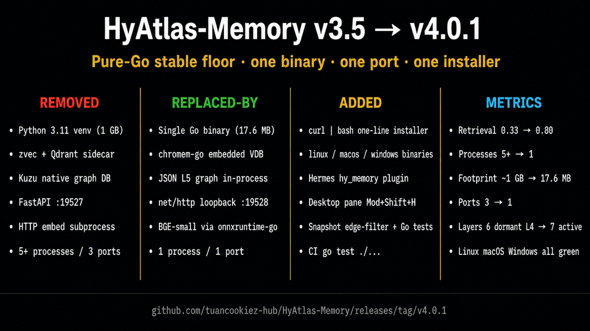

# Changelog

## [4.3.0] — 2026-10-08

Adds the extraction-mode selector, the slow path behind it, and the setup flow
that makes the modes reachable. Until now every write ran the same async LLM
pipeline with no way to opt out, so the only way to keep conversation text on the
machine was to not run the server at all — and there was no way to configure the
LLM through any wizard.

The modes differ in **how widely the server reasons**, not in how long a write
takes:

| Mode | LLM calls | Reasons about | Layers | Consolidation |
|---|---|---|---|---|
| `lite` | none | — | 1 / 7 (L2) | no |
| `pro` | one per write | within one turn | 5 / 7 | no |
| `ultra` | one per write + periodic batch | across memories and time | 7 / 7 | yes |

### Added

- **`HYATLAS_MODE` — `lite` | `pro` | `ultra` (default).** `lite` makes no LLM
  call at all: the raw trace and local embeddings are stored and nothing leaves
  the machine. `pro` extracts once per write and reasons within that single
  turn. `ultra` adds the slow path below. Settable via env var,
  `docker-compose.yml`, `.env`, the Windows launcher, and as a `mode` plugin
  setting forwarded to a spawned server.
- **The System1 / System2 layer split.** The two systems own disjoint layers, and
  this is what makes the layer counts differ per tier:
  - **System1 (per turn)** writes L1 Profile, L2 Raw, L3 Fact, L4 Summary and
    L7 Intention — what a single turn can actually evidence.
  - **System2 (slow path)** writes L5 Knowledge and L6 Schema. A relation worth
    keeping is corroborated by more than one turn, and a schema is a *recurring*
    pattern, so neither can be produced from one turn. The per-turn prompt used to
    ask for "0-2 recurring patterns" from a single input, which cannot work by
    construction; those guesses then competed with real ones at retrieval time.
    L5 edges now require at least two distinct corroborating facts, and fabricated
    evidence IDs are ignored.
- **The slow path (`consolidate.go`) — what ultra adds over pro.** A ticker-driven
  pass reasons *across* accumulated memories rather than within one turn, which
  is the only way to notice things no single write can see:
  - **merges** contradicting or duplicate L3 facts, writing the replacement
    before pruning what it absorbed;
  - **synthesises L5 knowledge** edges corroborated by multiple facts;
  - **generalises L6 schemas** visible only across many turns;
  - **synthesises a cross-session L4 arc** from the accumulated summaries;
  - **decays** L2 raw history past `HYATLAS_RAW_RETENTION`.
  Tuned by `HYATLAS_CONSOLIDATE_EVERY` (default `6h`) and
  `HYATLAS_CONSOLIDATE_BATCH` (default `200` facts per call, so the prompt cannot
  grow without bound).
- **`HYATLAS_SYNC_EXTRACT=on|off`** — whether a write *blocks* on its extraction.
  This is a separate knob from the mode, because blocking is a latency question
  and the mode is a capability question. Unset follows the mode: pro blocks and
  reports `done`/`failed`, ultra returns `pending` immediately. Either can be
  overridden, so `ultra` can be made blocking without losing consolidation and
  `pro` can be made background without gaining it. Exposed as a `sync` plugin
  setting too.
- **Setup, in both surfaces.** Three fields then it works — mode, LLM endpoint,
  API key:
  - `hermes memory setup` now offers `llm_base`, `llm_model` and `llm_key`. The
    key is declared `secret` with an `env_var`, which is load-bearing rather than
    cosmetic: `hermes_cli.memory_setup` masks the prompt, routes the value to
    Hermes' `.env` at `0600`, and prints the `url` as "Get yours at ...".
    `save_config()` strips `llm_key` defensively even if handed one, so a
    hand-edited config cannot land a credential in `hyatlas.json`. `llm_base` and
    `llm_model` are forwarded to a spawned server; an explicit export still wins.
  - `scripts/install.sh` asks the same three questions interactively and writes
    the answers to Hermes' `.env`. Guarded on `[ -t 0 ]`, so `curl | bash` in CI
    and pre-seeded installs never block. `lite` skips the endpoint and key
    entirely. Values are CRLF-stripped, an invalid mode falls back to ultra
    instead of persisting a value the server would reject, and the key is never
    echoed back.
  - Provenance: every L3 fact and L1 profile row now records `source_id`, the L2
    raw memory it came from. Without it the slow path could not cite evidence for
    an L5 edge, and raw decay could not tell which history the graph still
    depends on.
- **An actionable startup warning.** A mode that needs an LLM with no credential
  configured used to look healthy: `listeningLine` prints `llm=<model>` from a
  value that always has a default, and `/api/v1/status` reported `llm: "ok"`.
  The first write then returned a bare `failed` with the reason only in a log.
  The server now prints the exact exports needed plus the `HYATLAS_MODE=lite`
  escape hatch, status reports `llm: "unconfigured"`, and writes return
  `extraction_status: "unconfigured"` — distinct from `unavailable`, which meant
  "no client at all".
- **Deletion safety guards**, since the slow path is the first code that removes
  stored memories:
  - a merge, drop or edge may only name IDs that were actually in the input batch,
    so a hallucinated ID in the model's reply cannot delete or cite anything;
  - a "merge" naming fewer than two real facts is skipped — it would be a
    rewrite that loses provenance for no dedup gain;
  - **L2 raw cited by a live L5 graph edge is never decayed**, so consolidation
    cannot leave the knowledge graph pointing at a memory that no longer exists;
  - `HYATLAS_RAW_RETENTION` is opt-in. Unset, nothing is ever deleted.
- **`/api/v1/status` reports `mode`, `mode_detail`, `uses_llm`, `extract_sync`,
  `consolidations` and `last_consolidated`.** `consolidations` is `-1` when the
  mode has no slow path and `0` when it has one that has not run yet, so the two
  are distinguishable. The dashboard's `/api/info` reports the configured mode;
  it previously hardcoded `"ultra"` regardless of configuration.

### Changed

- **`/api/v1/digest` is real.** It returned a hardcoded `digest_ok: true` with a
  note saying "a full scheduled digest runs here" — nothing did, and a caller
  could not tell whether consolidation had ever run. `GET` now reports run count
  and the last report, `POST` triggers a pass on demand, and a mode with no slow
  path says so explicitly instead of claiming success.
- **Extraction is one code path, not two.** `handleAdd` and `handleReprocess`
  each kept their own inline LLM call with a duplicated 180s timeout. Both now go
  through `Server.extract()`. The HTTP transport moved into a shared
  `LLMClient.chat()`, so extraction and consolidation cannot drift on the two
  things that are easy to get wrong once and hard to notice later: the Cloudflare
  WAF 403s Go's default User-Agent, and the key must be resolved per request
  because a rotating JWT goes stale if frozen at startup.
- **`extraction_status` is derived**, not hardcoded `"pending"` at write time:
  `skipped` / `pending` / `done` / `failed` / `unconfigured`.
- **`Server.llmState()` is the single place** that decides what to report about
  the LLM, so status, the dashboard and the startup line cannot disagree.
- **`handleReprocess` explains itself in lite** rather than reporting zero work
  done with no reason.
- **An invalid mode or sync value is fatal, and validated before spawning.** The
  server rejects an unrecognised `HYATLAS_MODE` rather than silently falling back
  to ultra — someone who typos `lite` and quietly gets ultra would have their
  conversation text sent to an LLM they believed they had turned off, which is
  the exact boundary this selector exists to give. The plugin validates through
  the same alias table the server uses and raises from `start()` before any child
  process exists, so the failure surfaces where the user can see it instead of in
  `hyatlas.log` after a server that dies on boot.
- **`config_schema()` was dropping wizard metadata.** It passed through only
  key/description/default/choices, which silently demoted a secret field to a
  plaintext one — the API key would have been written into `hyatlas.json`. It now
  forwards `secret`, `env_var`, `url`, `when` and `default_from`.
- **`test_every_setting_is_documented_in_the_readme` was vacuous.** It checked
  whether the setting name appeared anywhere in the README, so `sync` "passed"
  because the word occurs inside "synchronous". It now requires an actual
  settings-table row.

### Tests

- 85 Go test functions pass under `-race`; 67 Python tests pass (4 skipped where
  fastapi is unavailable); `hermes plugins validate` passes 15/15; `bash -n` on
  the installer passes with LF endings preserved.
- `TestSystemPartitionCoversEveryLayerExactlyOnce` asserts the two systems
  partition all seven layers with no overlap and no orphan, so L5/L6 cannot
  silently drift back into the per-turn path. `TestSlowPathOwnsL5AndL6` checks it
  behaviourally: a per-turn extraction that volunteers knowledge and schemas must
  still write neither.
- `TestModesFormAMonotonicLadder` asserts each tier does everything the one below
  it does, so "ultra is better than pro" is a checked property rather than a
  claim in prose. `TestSyncKnobIsIndependentOfMode` and
  `TestSyncKnobDoesNotChangeCapability` pin the orthogonality: forcing ultra to
  block must not disable consolidation, and forcing pro to background must not
  grant it.
- `TestParseSyncParityWithPlugin` pins one truth table for both validators, so
  the Desktop form cannot accept a value the server then treats as fatal.
- Slow-path coverage includes merge-and-prune ordering, unknown-ID rejection,
  single-fact-merge rejection, L5 corroboration and fabricated-evidence
  rejection, evidence surviving the merge that consumed it, citation protection
  during decay, decay disabled without retention, null-arc handling, LLM failure
  survival, garbage-reply tolerance, batch capping, ticker firing and stopping on
  cancel, and zero interval not spinning.
- Every new assertion was verified non-vacuous by reverting the behaviour it pins
  and confirming the matching test fails — 10/10 Go guards and 3/3 installer
  guards caught. Shell mutations are syntax-gated first, because a mutation that
  breaks parsing "fails" for the wrong reason and proves nothing.
- All mode/knob combinations were exercised end to end against real servers with
  a call-counting mock LLM. Layer counts measured: `lite` 1/7, `pro` 5/7 (L1 3,
  L2 3, L3 6, L4 3, L7 3, with L5 and L6 at 0), `ultra` 7/7 (adding L5 2 nodes
  and L6 1 row after one consolidation pass). Sync independence measured: `ultra`
  with `sync=on` blocked 111 ms and still consolidated; `pro` with `sync=off`
  returned in 17 ms and still did not.
- The installer was driven through ten scripted scenarios (numeric and named
  tiers, blank input, garbage input, missing key, malformed URL, CRLF input,
  pre-seeded environment, and the non-interactive guard) against real MSYS
  git-bash, with `.env` contents and permissions inspected afterwards.

---

## Review fixes (teknium1, PR #134419)

Everything below addresses the catalog review of `ec0a3482` — what
leaves the machine, and what the spawned server inherits — plus
adjacent defects found while fixing those.

Addresses teknium1's catalog review of PR #134419 (what leaves the machine, and
what the spawned server inherits), plus two adjacent defects found while fixing
them.

#### Fixed

- **The spawned server inherited the agent's whole environment.** `HyatlasProcess._env()` was `os.environ.copy()`, so every API key and provider token the agent holds (`OPENAI_API_KEY`, `ANTHROPIC_API_KEY`, `GITHUB_TOKEN`, `DATABASE_URL`, …) was handed to a child process that then talks to a network endpoint. It now builds an explicit allowlist: the variables an OS needs to run a process at all, `HYATLAS_*` (the only prefix the server reads — `server.go` consults nothing else and never calls `os.Environ()`), and the TLS trust-anchor paths. Measured on a realistic agent environment: 9 planted secrets leaked before, 0 after, and 61 of 79 variables withheld. `SYSTEMROOT` is retained on Windows because without it the Go runtime cannot resolve DNS or complete a TLS handshake, so dropping it would break extraction in a way that looks like an endpoint problem. Verified end to end by spawning the real server under the minimal env and completing a write → extraction → search round trip.
- **Every turn re-uploaded the whole conversation to the extraction LLM.** `_build_turn_text()` preferred the full `messages` thread, and `sync_turn` is called after every turn with the conversation so far — so payload grew quadratically and the server re-extracted facts from messages it had already seen. It now sends only the current turn. Measured over 50 turns: 41,495 bytes → 1,534 bytes (96.3% less, 27× reduction).
- **The embedder defaulted to one developer's machine-local proxy.** `HYATLAS_EMBED_BASE` defaulted to `http://127.0.0.1:49200/v1`, which exists on nobody else's machine — the same defect class as the plugin-side proxy default removed in 4.2.5, and it contradicted the README, which documented a different default again. Now defaults to `bge`, the in-process local embedder, which is what every shipped install path already sets (`scripts/install.sh`, `hyatlas-go.ps1`, the release workflow, `docker-compose.yml`).
- **A relative `HYATLAS_MODEL_DIR` did not work on Windows.** The onnxruntime loader and the directory check resolved `./models` against different bases, so the same path found the model file and then failed on `onnxruntime.dll`. `resolveModelDir()` now returns an absolute path, preferring the cwd and then the executable's own directory, so both the dev-checkout and installer layouts work. The failure message when no model exists names one absolute path and lists the four ways to fix it, instead of a bare error.
- **The startup log misreported the embedder.** It printed `embedModel` unconditionally, so a server running local in-process BGE announced `embed=text-embedding-3-small` — which reads like a remote OpenAI embedder is configured. `describeEmbed()` names the embedder actually in use.
- **`backup_paths()` reported paths that never existed.** It returned relative names (`data/graph.json`), which resolve against the agent's CWD. `backup.py` drops any declared path that does not exist, so this provider contributed nothing to `hermes backup`. It now returns existing absolute directories, resolved from `HYATLAS_GO_DATA`, a new `data_dir` setting, then conventional defaults.
- **The system prompt hardcoded `127.0.0.1`** while the client honored `server_host`, so a remote server made the prompt state a wrong address. One `_origin()` helper now builds the address for the prompt, the client, and `unavailable_reason`.
- **`stop_running()` could never match.** It read a pidfile that `start()` never wrote, so `hermes hyatlas stop` after a gateway restart left the old server holding the port. `start()` now writes it and `_cleanup()` removes it. Writing it made a `taskkill /F` path live, so `stop_running()` first confirms the pid still belongs to `hyatlas-go` — a recycled pid from a crashed server would otherwise kill an unrelated process.
- **The dashboard hardcoded its server address.** `plugin_api.py` used `HYATLAS_HOST`/`HYATLAS_PORT` (keys nothing else in the plugin sets) instead of the plugin's real settings, so the pane ignored a configured host or port. Both now resolve through one shared `settings.py`; the env vars remain as an explicit escape hatch.

#### Added

- **`settings.py`** — one module owning settings resolution, shared by the provider and the dashboard. They are loaded by different machinery (`__init__.py` as a package, `plugin_api.py` by file path with no parent package, so it cannot use a relative import), and each keeping its own defaults is how they drifted. The dashboard loads the sibling by explicit path rather than manipulating `sys.path`, which catalog rule 9 forbids.
- **`resolveRuntime()`** — every server default in one struct rather than inline literals in `main()`, so the defaults are assertable. The first version of these tests called `envOr` with its own default argument and passed whether or not `main()` agreed; reverting the real default did not fail them.
- **`data_dir` plugin setting** (`HYATLAS_GO_DATA`), exposed in `config_schema`.
- **Regression tests** for every item above: 14 new Go tests and 20 new Python tests (39 pass, 4 skip where fastapi is unavailable — separately verified passing against real fastapi 0.133.1). Each fix was verified non-vacuous by reverting it and confirming the matching tests fail.

#### Disclosure

**No LLM endpoint is assumed.** `HYATLAS_LLM_BASE` and `HYATLAS_LLM_MODEL` shipped with a remote default (the Nous Portal inference API, `poolside/laguna-s-2.1:free`), so an unconfigured `pro`/`ultra` server had somewhere to send memory text. Extraction is the only thing that leaves the machine, so the endpoint is the user's choice, not ours: both defaults are now empty.

An unconfigured server makes no LLM call. It stores the raw trace plus local embeddings, reports `llm: "unconfigured"` in status and `extraction_status: "unconfigured"` per write, and warns at startup naming the unset variables. The installer and `hermes memory setup` still offer that free Nous Portal endpoint as a starting value the user can accept or overwrite, so the onboarding is three answers either way — but accepting is now an explicit choice.

The readiness gate is one method, `LLMClient.Configured()`, requiring endpoint **and** model **and** key. Checking the key alone was not sufficient once the defaults went away: a missing endpoint is the same "not ready" state, and a key-only check would report `ok` and then POST to an empty URL. Status, extraction and the startup warning all consult it, so they cannot disagree.

The repo README gains a *Privacy — what leaves your machine* table separating the local parts (embeddings, storage) from the opt-in remote one (extraction), and the "local-first" tag is renamed `self-hosted`. The catalog entry, plugin README and repo README all state the opt-in behaviour explicitly.

Two stale claims were corrected in the same pass. The plugin README asserted extraction "fires on every write even if you have not set a key — so out of the box your turn text is transmitted there"; that was true at v4.2.5 and stopped being true when the credential gate landed, so the disclosure overstated what the code did. And `extractForMode`'s docstring still described the pre-split behaviour ("fills L1 … L6 … the layers are always all or nothing"), on the one function a reader consults to learn what each mode does.

Verified against real servers with a canary endpoint counting requests: default install transmits **nothing** and fills 1/7 layers; with all three set, extraction fires and fills 4/7; with base and key but **no** model, nothing fires. 8/8 mutations of the new defaults, gate and warning were caught.

## [4.2.5] — 2026-10-07

### Fixed
- **The plugin invented an LLM endpoint and forwarded a credential.** `HyatlasProcess.start()` seeded `HYATLAS_LLM_BASE` to a developer's local proxy (`127.0.0.1:49200`), `HYATLAS_LLM_MODEL` to a specific model, and copied `AI2API_KEY` into `HYATLAS_LLM_KEY` for the spawned server. Any user who installed from the catalog and enabled `auto_start` got a server pointed at somebody else's proxy, and a secret was copied from one environment variable into another. Both contradict the plugin's own documented disclosure ("no LLM credentials live in or flow through this plugin") and `save_config`'s existing contract that no LLM creds belong in the plugin's config. The subprocess env is now built by `HyatlasProcess._env()`, which only inherits the caller's environment and binds the server to loopback — `HYATLAS_LLM_*` remain the server's own concern, and whatever the user exported still reaches it unchanged.
- **A machine-specific path shipped to every installer.** `cli._launcher()` fell back to `F:/HyAtlas-Memory-Go/hyatlas-go.ps1` — the author's drive letter — so the Windows launcher was discovered on the author's machine and on nobody else's. Removed. The launcher is now opt-in and explicit.

### Added
- **`launcher_path` config key** (plus `HYATLAS_LAUNCHER_PATH`), so an install that ships its own `hyatlas-go.ps1` beside the binary can point at it instead of relying on a baked-in location. Resolution order is the configured path, then a launcher beside `binary_path`, then no launcher at all — in which case `start` spawns the binary directly, which is what a catalog install does.
- **Five disclosure-invariant tests** pinning both fixes: the subprocess env forwards no credential and invents no endpoint; user-exported `HYATLAS_LLM_*` still reach the server; no absolute developer path (`F:/`, `C:/Users/`) exists in any non-test plugin source; launcher resolution requires an explicit path; and `launcher_path` flows through both the JSON and env config layers. Verified non-vacuous by reverting each fix and confirming the corresponding tests fail.

## [4.2.4] — 2026-10-07

### Fixed
- **`Close()` never drained async persistence, despite claiming to.** Its comment said "drains any pending async persistence", but `persistUsageAsync()` spawned fire-and-forget goroutines with nothing tracking them, so `Close()` returned while they were still running. They then wrote `usage.json.tmp` into the data dir *after* the caller had moved on — on CI that made `t.TempDir()` cleanup fail with `unlinkat ...: directory not empty`, which failed the whole `go test` run in the `Build (Go 1.26, plain — Linux)` job. `Close()` now uses a `sync.WaitGroup` plus a `sync.Once`, so it is both synchronous and idempotent.
- **Concurrent usage writes could clobber each other.** `persistUsage()` writes a single fixed `.tmp` path, and every `Add`/`Search` fires an async persist, so two goroutines could interleave and rename a half-written file. The write is now serialized by a mutex. This is a real (if narrow) data-corruption window on a busy server, not just a test-only artifact.

### Added
- **`store_close_test.go`** (3 tests): `Close` drains in-flight async persistence so the data dir is removable afterwards; `Close` is idempotent and safe under concurrent calls; and concurrent `persistUsage` does not corrupt the file.

### Verification note
The drain test was validated by reverting the fix and confirming it fails with the *exact* CI error (`usage.json.tmp left behind after Close`, then `TempDir RemoveAll cleanup: ... directory not empty`). An earlier draft of that test passed vacuously because it hardcoded the wrong filename (`counts.json` instead of the real `usage.json`) and let the driver goroutines finish before `Close`; it now derives the path from the store and keeps persists continuously in flight across the `Close` call.

## [4.2.3] — 2026-10-07

### Fixed
- **CI `plugin-tests` job could never pass.** The standalone smoke runner classified a legitimate skip as a failure: `_check_live_server_round_trip` returned a "skip" signal, but `_run_all` derived its verdict by string-sniffing the message (`ok and "SKIP" not in msg`), so "no live server" — the normal condition on CI — counted as a failed test and exited 1. Checks now return an explicit `PASS`/`SKIP`/`FAIL` token, both runners (standalone and pytest) consume that one contract, and SKIP is pass-equivalent. The outcome is never inferred from message text again.
- **`_check_config_loads_clean` asserted the default port as an invariant.** It hardcoded `== 19528`, so it spuriously failed whenever the supported `HYATLAS_SERVER_PORT` override was in play. It now derives the expected port the way the plugin does (env override, else 19528) and also asserts the value is a positive int. The SKIP message likewise reports the configured `host:port` instead of a hardcoded address.

### Verified
- With a live server: 18 pytest tests pass and the standalone runner exits 0 (all PASS).
- With no reachable server (CI's condition): standalone runner exits **0** reporting `1 skipped`; pytest reports `2 passed, 1 skipped`.
- Negative test: injecting a genuine FAIL still exits **1** — the runner detects real failures, so SKIP handling did not make the suite vacuous.

## [4.2.2] — 2026-10-07

### Fixed
- **The agent-facing prompt advertised a tool that does not exist.** `system_prompt_block()` told the agent that a `hyatlas_save` tool was mirrored to L1. No such tool was ever registered — the v4.2.0 `hy_memory` → `hyatlas` rename sweep wrongly renamed a reference to Hermes **core's** `memory` tool, which is not ours to rename. The provider registers exactly four tools (`hyatlas_status`, `hyatlas_search`, `hyatlas_recent`, `hyatlas_add`); mirroring happens through the `on_memory_write` hook, which core calls for its own `memory` tool. The prompt now names the real tools and refers to the standard `memory` tool correctly.

### Added
- **Regression test** asserting every `hyatlas_*` tool name mentioned in `system_prompt_block()` is one `get_tool_schemas()` actually registers. Verified the guard works by reverting the fix and confirming the test fails with the offending name.

## [4.2.1] — 2026-10-07

> Catalog-submission hardening. No breaking changes.

### Fixed
- **Desktop pane and dashboard showed a frozen `v4` badge.** The pane hardcoded the string `"v4"` in two places (header subtitle and the "Memory saved" toast), so it read v4 forever regardless of the running server. `/api/v1/status` now carries a `version` field sourced from one canonical `Version` const in `server.go`; `handleDashInfo` reads the same const instead of its own duplicate literal. The pane derives `const ver` from `status.version` once and uses it at both sites, falling back to `"v4"` only while connecting. Releasing is now a one-line change.
- **L5 count consistency (unified).** `LayerCounts()` now always reports `l5_knowledge` as the graph node count (L5 lives in the graph store, never chromem). Previously the override was hand-applied only in `handleStatus`/`handleDashLayerCounts`, so `/api/v1/list`, `/api/v1/metrics`, `/api/layer-health` and `/api/metrics` reported `l5_knowledge: 0` while `/status` reported the real count. One source of truth in the store; per-handler overrides deleted.
- **Rotating LLM credentials no longer stall extraction.** The server froze `HYATLAS_LLM_KEY` at startup, so a short-lived token — the Nous Portal key is a 1-hour JWT that Hermes keeps fresh in `auth.json` — expired under a long-running server and every extraction call then failed with a generic HTTP 401 (`write_pipeline: degraded`) until a manual restart. New optional `HYATLAS_LLM_KEY_FILE` makes `LLMClient.resolveKey()` read the key live from the file per call (auth.json JSON shape or a plain-text token); the static `HYATLAS_LLM_KEY` stays as the fallback and as the only key for normal static-API-key users. `hyatlas-go.ps1` now sets it to `auth.json`. No timers or refresh goroutines — verified E2E (live extraction fired +2 L3 facts in 10s) and by `llm_keyfile_test.go` (4 tests, incl. rotate-the-file-and-assert-the-new-key-hits-the-wire).
- **Plugin config precedence.** `_load_config` now layers the legacy `plugins.hyatlas` block and `plugins.entries.hyatlas.settings` **per key** (settings wins key-by-key) instead of picking one dict wholesale — a partially-filled Desktop settings form no longer shadows keys the legacy block sets.

### Changed
- **`/api/v1/status` is marshaled from the `Status` struct directly.** The handler previously built a `Status` value and then restated every field by hand in a `map[string]any`, defining the wire shape twice — the struct's json tags were dead code. One definition now, so the tags are the contract.
- **`handleDashLayerCounts` takes one consistent snapshot.** It called `UsageForJSON()` twice (two separate atomic loads — writes and searches could come from different moments) and `TotalMemories()` twice. Now reads each once. `UsageForJSON` became dead and was deleted.

### Added
- **Plugin unit tests** (`plugins/hyatlas/tests/test_plugin_unit.py`, 14 tests): client wire round-trip against a real localhost HTTP server (no mocks), typed error/unreachable handling, config precedence + legacy-garbage rejection, `save_config` round-trip, `handle_tool_call` dispatch for all 4 tools + unknown + uninitialized, `sync_turn` best-effort/empty-skip, `on_memory_write` add-only mirroring, availability probe, and the `delete_all` unscoped-wipe guard.
- **Go regression tests**: `l5_counts_test.go` (L5 is graph-derived; every count-reporting endpoint agrees with `/api/v1/status`), `llm_keyfile_test.go` (live key-file resolution, fallbacks, on-the-wire rotation), `version_test.go` (status + dash info report the real version; full status wire contract).
- **CI `plugin-tests` job**: runs the plugin pytest + standalone smoke runner on a clean Python using the `agent.memory_provider` ABC extracted from the published hermes-agent wheel (no full Hermes install). Verified locally in a scrubbed venv: 17 passed.
- **Catalog art**: `docs/images/banner.png` (1200×600, the documented `image` size) plus the two live Desktop pane screenshots used for `screenshots:`.

## [4.2.0] — 2026-10-07

> **Plugin renamed `hy_memory` → `hyatlas`** for the Hermes Plugin Catalog submission — the catalog key, manifest name, provider name, CLI command, and Desktop pane id now all read `hyatlas`. Breaking for existing installs: update `memory.provider: hyatlas` and re-enable the plugin under the new name.

### Changed
- Plugin directory, manifest `name`, `MemoryProvider.name`, `hermes hyatlas` CLI command, dashboard manifest, and desktop pane id all renamed `hy_memory` → `hyatlas`.
- Config reads `plugins.entries.hyatlas.settings`; env overrides unchanged (`HYATLAS_SERVER_*`).
- Catalog submission: `plugin-catalog/hyatlas.yaml` entry prepared (category memory, tier community, sha pinned).

## [4.1.4] — 2026-10-07

> **Hermes plugin catalog readiness.** The `hy_memory` plugin now passes catalog admission (`hermes plugins validate` clean: manifest v2, security scan safe, no core override, desktop surface inside the SDK) and gains a Desktop settings form.

### Changed
- **`plugin.yaml` → manifest v2:** `config_schema` for all seven settings (renders as the Settings → Plugins form in Hermes Desktop); `requires_hermes: ">=0.21.4"`; honest description. Dropped the misdeclared `requires_env` (the vars are optional overrides — declaring them would have disabled the plugin at install) and the `provides_tools`/`hooks` lists (those come through the MemoryProvider ABC, not `register()`).
- **`_load_config` reads `plugins.entries.hy_memory.settings`** from `config.yaml` — the location the Desktop settings form writes. Priority: env > settings > legacy `plugins.hy_memory` block > per-profile JSON.
- **Plugin README rewritten** for the catalog page: what you get, install (server is a separate install — not bundled, not auto-downloaded), settings, and explicit runtime disclosures (network, subprocess, data).
- Version metadata bumped to **4.1.4** across installer, manifest, dashboard manifest, `/api/info`, docker-compose.

## [4.1.3] — 2026-10-07

> **Data-safety hardening.** Fixes a latent full-store wipe, makes extracted flags survive restarts, and pins the new extraction paths with tests.

### Fixed
- **`delete_all` could wipe the entire store:** the endpoint only read scoping from query params, while the `hy_memory` plugin client sends it in the JSON body — a plugin-scoped delete silently became an unscoped wipe. Scoping is now read from both styles, and a truly unscoped call requires `confirm=wipe-all` (400 otherwise).
- **Extracted flags reset on every restart:** startup always rebuilt the doc index from chromem metadata, which never carries the `extracted` flag. The store now loads the persisted `doc_index.json` first (size-checked against the collections; falls back to rebuild on mismatch), so `/api/v1/reprocess` no longer re-runs already-extracted rows after a restart.
- **Data race on `lastExtractErr`:** written from extraction goroutines while `/api/v1/status` read it. Now RWMutex-guarded (verified under `-race`).

### Added
- **Test coverage for the v4.1.2 paths** (`fixes_test.go`, `llm_retry_test.go`): reinforced-retry recovery + give-up (mock LLM), reprocess-by-ids contract, extracted-flag restart persistence, stale-index rebuild fallback, delete-guard matrix, concurrent extract-err. 7 new tests, green under `-race`.

### Changed
- Version metadata bumped to **4.1.3** across installer, `plugin.yaml`, dashboard manifest, `/api/info`, docker-compose.

## [4.1.2] — 2026-10-06

> **Extraction resilience.** Restores the memory write pipeline after a silent extraction outage (2026-09-05 → 2026-10-06) and hardens it against both failure classes found during recovery.

### Fixed
- **Extraction stalled by a WAF (silent for a month):** the Nous Portal sits behind Cloudflare, which rejects Go's default `Go-http-client` User-Agent with HTTP 403. `llm.Complete` now identifies honestly (`HyAtlas/4.1 (+repo URL)`).
- **Conversational-reply extraction failures:** on some personal-style input the extraction model replied with prose instead of JSON, failing the parse. `Complete` now performs one reinforced retry before giving up — recovered ~95% of previously-failing rows in the outage backfill.
- **`/api/v1/list` raw filtering:** `include_raw=false` is applied before pagination (and to `total`), so `recent`-style queries no longer return empty pages when the newest page is all raw rows.
- **Hermes plugin CLI:** `hermes hy_memory …` boots cleanly (synthetic-package import fix); `start`/`stop` delegate to the canonical `hyatlas` launcher; the unavailable warning cites the real command.
- **Plugin launcher:** spawning no longer hangs when the caller captures stdout (file-sink + bounded wait + health fallback).

### Added
- **`/api/v1/reprocess` by ids:** accepts `{"ids": [...]}` to re-extract exact rows (extracted-skip bypassed) alongside `{"max": N}`; response reports `reprocessed` / `failed` / `skipped`.
- **Starmap learning graph:** `/api/v1/learning/graph` returns the Hermes-Desktop StarmapGraph shape (knowledge + co_session + semantic edges), proxied by the plugin's `plugin_api.py`.
- **Mind Palace dashboard updates:** new starmap assets + `desktop/plugin.js` observatory work.

### Changed
- `reprocess` marks rows extracted after a successful promotion.
- Version metadata bumped to **4.1.2** across installer, `plugin.yaml`, dashboard manifest, `/api/info`, docker-compose.

## [4.1.1] — 2026-09-04

> Edges + CI hardening. `/api/v1/edges` (knowledge / co_session / semantic edge types), `DocIndex.Meta` (session_id in list endpoints), Linux CI tempDir race fix (`store.Close()` + `t.Cleanup`), plugin Graph tab with type-colored edges.

## [4.1.0] — 2026-09-04

> Mind Palace. Bitemporal L5 graph with evidence citations (`Source` / `RecordedAt` on edges), `/api/v1/graph-as-of` time-travel endpoint, and the Hermes Desktop `hy_memory` Mind Palace visualization.

## [4.0.1] — 2026-09-02

> **Stable floor.** Aligns the GitHub tag with the code you actually run: one-line installer, desktop pane, Hermes plugin, and a graph snapshot that never returns dangling edges.

### Added
- One-line installer (`scripts/install.sh`) + GitHub Actions release pipeline for linux-amd64 / macos-arm64 / windows-amd64.
- v4-native Hermes `hy_memory` plugin (provider + desktop pane at `/hyatlas`, shortcut Mod+Shift+H).
- Desktop Graph tab: Three.js L5 constellation (hover neighborhood, Field Note).
- `graph.Store.Snapshot` tests (dangling-edge filter, edge dedupe, persist round-trip).

### Fixed
- Bounded graph snapshots dropped nodes but kept all edges — clients saw dangling `from`/`to`. Snapshot now filters relations to the returned node set.
- Release CI: macOS onnxruntime asset is `osx-arm64` (not `osx-universal`); tag resolution on `workflow_dispatch`.
- Desktop pane backend: `dashboard/manifest.json` `api` must be `plugin_api.py` (relative to `dashboard/`).

### Changed
- Installer default tag is `v4.0.1`.
- Dependabot alerts on `uv.lock` / `transformers` are stale Python-floor leftovers; v4 has no Python runtime.
- Extraction LLM default is a Nous Portal `:free` model (`poolside/laguna-s-2.1:free`), not DeepSeek.
- `/api/v1/status` and `/api/info` now expose `llm_model` and `llm_base` so the desktop pane and dashboard can show the live extraction LLM.
- Go tests cover the new status / info fields (`server_test.go`).

## [3.5.0] — 2026-08-17

> **v3.5.0 floor refresh (2026-08-17).** Same `3.5.0` tag, new floor. Live compaction wired into the single-memory write path, configurable LLM primary + fallback chain, autostart flipped off-by-default upstream, and the shadow `LLMConfig` class finally aligned with `core.config.LLMConfig`. This is the new stable floor before the planned memory-system overhaul.

### Added
- **LLM primary + fallback chain.** `hy_memory.json` now supports `llm.fallback_model` / `fallback_base_url` / `fallback_api_key`. When the primary returns 429/502/503/504/connection/timeout/unavailable, the server automatically switches to the fallback model once. Single transition, no infinite fallback loop.
- **`hyatlas status` wired** to the CLI module so `hyatlas status --short` returns real data.
- **`llm_identity()` helper** in `config_cli.py` resolves provider/model from the `model` field prefix (e.g. `provider/model:variant`).

### Fixed
- **Shadow `LLMConfig` class.** `core/agent/llm_provider.py` had a duplicate `LLMConfig` definition (line 98) that lacked every new field. Both classes now have the same 4 fallback fields, eliminating the `TypeError: got an unexpected keyword argument 'fallback_model'` that blocked server startup after the original free-model wiring.
- **zvec fragmentation regression.** Ordinary `upsert()` writes now run the same `maybe_compact()` threshold check as `upsert_batch()`, guarded by a 60-second cooldown and single-flight lock. Reclaimed 18.33 GB / 3,443 shards in the live store on 2026-08-17 (19.75 GB → 1.42 GB).
- **Weekly digest scripts** use canonical `l3_fact` after the L1–L7 renumber and run through the dedicated HyAtlas venv (`D:\HyAtlas\.hyatlas\venv`).
- **Digest timeout coverage:** `concurrent.futures.TimeoutError` is now caught on Py3.10 alongside the existing `asyncio.TimeoutError` path.

### Changed
- **Plugin `auto_start` defaults to off upstream** (`__init__.py` runtime + config loader, `config_cli.py` setup). Explicit local `auto_start: true` remains supported and is preserved in this repo's `hy_memory.json`.
- **`hyatlas status`, `config`, `doctor`, and `console`** display only the configured LLM provider and model (e.g. `Provider: openai` / `Model: gpt-4o`).

### Tests
- 167 tests collected, **166 passed, 1 skipped**, `ruff check src/ tests/` clean.
- New: `tests/test_zvec_lifecycle.py` (compaction cooldown + single-flight), `tests/test_autostart_default.py` (missing-key-off invariant), `tests/test_config_cli_embedder.py::test_llm_identity_prefers_model_prefix`.

## [3.5.0] — 2026-08-05

> **Certified stable floor:** truthful dashboard data contracts, bounded list/count APIs, explicit Kuzu health, Windows lifecycle recovery, extraction resilience, and a lighter BGE-small/384 local default. No v3.5.1 split: these fixes are folded into the maintained v3.5.0 floor.

### Stable-floor certification (2026-08-05)

- **Truthful dashboard datasets:** VDB memories, Kuzu graph nodes/relations, coding records, and operational metrics are separate contracts. Graph derivations no longer masquerade as memory writes or activity. All eight dashboard pages were walked against live canonical data with zero JavaScript errors.
- **Bounded dashboard load:** `/api/memories` now caps its initial per-user fetch at 100 rows, opts out of graph payloads, and uses exact count-only scans. The pathological path dropped from 98–152 MB responses to tens/hundreds of KB while preserving truthful totals.
- **Honest health:** `/api/v1/status` and dashboard health include Kuzu readiness and node counts. Embedder/VDB/Kuzu-down contract tests prevent false-green status.
- **Crash/reopen contract:** zvec collection resolution accepts either a base or already-suffixed physical name, and potentially blocking C++ open/create calls run off the asyncio loop. A real subprocess regression test force-kills a zvec owner, confirms all three zero-byte `LOCK` marker files remain, then proves a fresh process reopens the collection and reads the persisted record. **Do not delete these marker files**; they also exist while a healthy owner is live.
- **Lighter local default:** new local configurations use `BAAI/bge-small-en-v1.5` (384d). BGE-large/1024 remains available with `hyatlas config embedder --preset large`. Dimension changes use a separate `agent_memories_<dims>` collection; users may intentionally start fresh instead of re-indexing.
- **Additive Kuzu dimension migration:** an existing graph created with `embedding FLOAT[1024]` is preserved when the active embedder changes to 384d. HyAtlas adds `embedding_384` / `beh_embedding_384` plus `memory_content_idx_384`, routes new graph writes/search to that lane, and exposes active/legacy dimensions in health. Historical graph nodes, relationships, and 1024d vectors remain untouched; no full graph re-index is required.
- **Digest timeout recovery:** System 2 digests now use a dedicated `MEMORY_DIGEST_TIMEOUT` (3600 seconds by default) instead of the generic 300-second synchronous-client limit. A genuine timeout cancels the scheduled coroutine and returns `504 digest_timeout`, preventing hidden background mutation after the caller receives an error. The local-embed server E2E also runs explicitly offline so cached BGE startup is deterministic on restricted networks.
- **Patched 3 RCE advisories in transformers (2026-08-09):** upgraded the isolated HyAtlas venv to `transformers 5.14.1` (all 3 open Dependabot advisories, GHSA-fgcw-684q-jj6r / GHSA-29pf-2h5f-8g72 / GHSA-69w3-r845-3855, are fixed by ≥5.5.0) with `sentence-transformers 5.7.0` (the only line compatible with transformers 5). `huggingface-hub` floor lifted from `<1.0` to `>=0.23.2` (transformers ≥5.5 requires hub ≥1.5; the faster-whisper conflict that motivated the `<1.0` pin isn't present in the isolated HyAtlas venv). Verified `BAAI/bge-small-en-v1.5` produces byte-identical 384-dim embeddings (dims, cosine 0.5401, first-4 dims unchanged) on the new stack — no re-embed, no model change. Full suite green, live add+search round-trip healthy.
- **Self-maintaining zvec compaction (2026-08-09):** `ZvecVectorStore` now auto-compacts on real fragmentation, not a schedule. After every bulk write (`upsert_batch`) it checks the `.proxima` segment count against a threshold (default 64, `ZVEC_COMPACT_SEGMENTS`); if crossed it runs `optimize()` to merge the near-empty 5 MB shards. The post-digest compact is retained for the heavy consolidation burst. This permanently prevents the tens-of-GB bloat that a store with no `optimize()` step accumulates (was 16 GB / ~900 points).
- **Layer numbering closed (2026-08-08):** the retired `L4 IDENTITY` slot was dropped and every layer index shifted down by one (`L0/L1/L2/L3/L5/L6/L7` → `L1/L2/L3/L4/L5/L6/L7`). VDB payloads were rewritten (`l0_basic_info → l1_profile`, `l1_raw → l2_raw`, `l2_fact → l3_fact`, `l3_summary → l4_summary`); Kuzu graph storage values for `l5_knowledge / l6_schema / l7_intention` were unchanged. The historical archive file `archive/l4_identity_pre_migrate_20260707.jsonl` is now deleted (no rows referenced it any longer).
- **Profile hygiene:** stale HyAtlas copies in the trading profile were synchronized or archived so every active profile receives the same v3.5.0 zvec/Kuzu guidance.

### Dependencies

- **`zvec>=0.6.0`** (was `>=0.5.1`) in the `[zvec]` extra. zvec 0.6.0 fixes the Windows collection LOCK open bug that left `agent_memories_1024` unopenable after crash / `taskkill` under 0.5.1. Live verified 2026-07-25: reindex from Kuzu (2682/2682, 0 errors), write + search green, dedicated venv embedder OK. Install/upgrade: `pip install -U "hyatlas-memory[zvec,local-embed]"` (or `pip install -U "zvec>=0.6.0"` into the HyAtlas venv), then `hyatlas stop && hyatlas start --detach`.

### Added — dedicated venv for dependency isolation

- **`hyatlas venv setup`** command: creates an isolated venv at `$HYATLAS_HOME/venv` and installs HyAtlas with `[zvec,local-embed]`. Idempotent (skips creation if the venv exists; `--clear` forces recreation). Verifies the local BGE embedder loads before reporting success.
- **`layout.venv_python()` / `venv_pythonpath()`**: resolve the dedicated venv's base `pythonw.exe` (GUI subsystem) and the PYTHONPATH entries it needs. Both the CLI launcher (`_start.py`) and the plugin auto-start (`process.py`) now prefer the dedicated venv when present, falling back to the current interpreter otherwise.

### Why this matters

HyAtlas's heavy deps (sentence-transformers, torch, transformers, zvec) conflict with host-app packages in a shared venv. Concretely: Hermes's `faster-whisper` pins `huggingface-hub>=1.0` while the local BGE embedder needs `<1.0` — the two cannot coexist, so the embedder silently broke (`embed: error: invalid model ID`) whenever the shared venv resolved to 1.x. A dedicated venv removes the conflict permanently. This matches how Hindsight (the flagship Hermes memory provider) runs: a separate daemon with isolated deps via `uv`.

### Fixed — orphan console windows (Windows), for real this time

The v3.4.6 fix (spawn via base `pythonw.exe`) was incomplete: the venv shim's `pythonw.exe` re-execs to the base `python.exe` (console subsystem), and the launcher's own re-exec bypassed the dedicated-venv selection. v3.5.0 resolves the venv's **base** `pythonw.exe` via `pyvenv.cfg` and re-execs the launcher into it with the venv's site-packages on PYTHONPATH. Verified: server + dashboard run as `pythonw.exe`, orphan console count stays at the Windows Terminal host baseline (no HyAtlas-attributable orphans).

### Fixed — reconciler trailing-comma JSON repair (from 3.4.7)

LLMs (incl. MiniMax-M3) emit JSON with trailing commas (`[{"op":"ADD",...},]`), which strict `json.loads` rejects — silently dropping the reconcile op (memory data loss). `MemoryReconciler._loads` now strips trailing commas before `]`/`}` and retries. Plus 9 tests pinning the parse contract.

### Verified

- `embed: ok` from the dedicated venv (was `embed: error` in the shared venv)
- Server + dashboard run as base `pythonw.exe` (GUI subsystem)
- End-to-end write: `success: True`, memory stored
- zvec **0.6.0** floor: LOCK reopen works; VDB reindex from Kuzu succeeded (2682/2682)
- 78 tests pass, ruff clean

### Added — extraction resilience (stable floor)

- **`extraction_status` in add response**: the `/api/v1/add` response now includes `extraction_status` (`"success"` / `"failed"`) with `extraction_error` and `extraction_error_code` when LLM extraction fails. Callers can immediately detect orphaned `l1_raw` instead of discovering it via empty search results.
- **`POST /api/v1/reprocess`**: recovery endpoint that finds orphaned `l1_raw` memories (active, unextracted) for a user, re-submits them through the normal add pipeline, and cleans up the orphans on success. Body: `{"user_id": "...", "agent_id": "...", "limit": 20}`.
- **`reasoning_content` capture**: `LLMResponse` now captures the `reasoning_content` field from reasoning models (DeepSeek-R1, MiniMax-M3). When `content` is empty but `reasoning_content` has text, the provider falls back to `reasoning_content` as content. All four call paths populate the field.
- **PII scrub**: `smoke_test.py` hardcoded-path detector no longer embeds the author's username — uses a regex pattern instead. Zero username leaks in `tests/` or `src/`.
- **Integration tests**: `TestExtractionResilience` — 3 tests covering `extraction_status` in add response, reprocess with no orphans, and reprocess input validation.

Upgrade: `pip install -U git+https://github.com/tuancookiez-hub/HyAtlas-Memory.git`, then `hyatlas venv setup`, then restart the stack. Ensure `zvec>=0.6.0` is installed (`pip install -U "zvec>=0.6.0"` if the resolver did not pull it).

## [3.4.7] — 2026-07-22

### Bug fixes

- **Reconciler trailing-comma repair**: LLMs (incl. MiniMax-M3) frequently emit JSON with trailing commas (`[{"op":"ADD",...},]`), which strict `json.loads` rejects — silently dropping the reconcile op (memory data loss). New `MemoryReconciler._loads` tries strict parse first, then strips trailing commas before a closing `]`/`}` and retries. Safe: a trailing comma is never valid JSON, so removal cannot corrupt well-formed input.
- Added `tests/test_reconciler_parse.py` (9 tests) pinning the parse contract: clean arrays, code fences, trailing commas (flat + nested), `\<think\>` stripping, group format, empty/prose/garbage inputs. No mocks — exercises the real `_parse_ops`.

Upgrade: `pip install --upgrade --force-reinstall git+https://github.com/tuancookiez-hub/HyAtlas-Memory.git` then restart.

## [3.4.6] — 2026-07-22

### Bug fixes

- **Reconciler `\<think\>` strip**: MiniMax-M3 (and other reasoning models) can emit `\<think\>...\</think\>` blocks into the `content` field, which broke JSON parsing in the reconcile pipeline (3 failed attempts → dropped write). Now stripped in `_strip_code_fence` before parsing. Pairs with `reasoning_split=true` in config, which routes thinking to a separate `reasoning_details` field so content stays clean.
- **`huggingface-hub` pin moved to core dependencies**: was only in the `local-embed` optional extra, so a shared venv could float it to 1.x and silently break the local embedder (transformers 4.46.x requires `<1.0`). Now `huggingface-hub>=0.23.2,<1.0` is a core dep — pip's resolver enforces it on every install.
- **Blank orphan console windows on Windows**: the plugin auto-start (`StackManager`) and CLI launcher spawned services via the venv shim (`python.exe`), which re-execs to a console-subsystem base python. Windows then allocated a COM console (Windows Terminal tab) that lingered as a blank orphan after the launcher exited. Now both paths spawn the base `pythonw.exe` (GUI subsystem — no console is ever allocated) with the venv site-packages + editable source dir on `PYTHONPATH`. The deliberate `hyatlas console` status window is unaffected.

Upgrade: `pip install --upgrade --force-reinstall git+https://github.com/tuancookiez-hub/HyAtlas-Memory.git` then restart.

## [3.4.5] — 2026-07-19

### Bug fixes (log noise)

- **`DisabledCache.cleanup_old_metrics`**: MetricsCollector hourly cleanup called a method that only existed on `SqliteCache`. Added no-op on `DisabledCache` + tolerance lists in `integrations` / `patches` so the hourly loop no longer logs `cleanup error: 'DisabledCache' object has no attribute 'cleanup_old_metrics'`.
- **`vector_store_zvec._safe_topk`**: clamp all `query(..., topk=...)` values to live `coll.stats.doc_count`. Stops zvec 0.5.1 C++ spam `ID is out or range: id[N] count[N]` from `doc_filter.cc` when callers used `topk=100000` on smaller collections.

### Docker

- Image tag in compose bumped to `3.4.5` (same zvec-native stack as 3.4.4 Docker rewrite).

Upgrade: `pip install --upgrade --force-reinstall git+https://github.com/tuancookiez-hub/HyAtlas-Memory.git` then restart.

## [3.4.4] — 2026-07-19

> **Schema fix: `update_payload` was passing `"embedding"` (a VECTOR field) as a scalar field, triggering `schema validate failed: embedding not found in collection schema` on every reconciler UPDATE operation.** v3.4.3 tried to fix this with a fields-only update path, but the real root cause was upstream — the reconciler in `writer.py:586` was passing `"embedding": new_emb` in the `update_payload` dict, and `update_payload` was putting it in the scalar `clean` dict. zvec's `convert_to_cpp_doc` then tried to validate `"embedding"` as a scalar field, which failed because `embedding` is a VECTOR field.

### Bug fixes

- **`vector_store_zvec.py` — `update_payload()`**: detect `"embedding"` in the updates dict and route it to `update_embedding()` (the dedicated vector update method) instead of trying to pass it as a scalar field. Scalar updates are applied via the fields-only path. This fixes the root cause that v3.4.3's fields-only path was trying to work around.
- **`core/server.py` — `_json_response()`**: wrap the response write in a try/except for `ConnectionResetError` / `ConnectionAbortedError` / `BrokenPipeError`. The dashboard polls `/api/v1/status` every 5s with a short timeout; when it abandons a request, the server threw `ConnectionAbortedError` and logged a full stack trace. Now it silently drops the response and exits cleanly.

### Docker (zvec-native)

- **`Dockerfile` / `docker-compose.yml` / `docker/entrypoint.sh`**: replace legacy Qdrant multi-service compose with a single **zvec** stack (API + dashboard). Binds `0.0.0.0` inside the container; data in volume `hyatlas_data` → `/data/hyatlas` (`HYATLAS_HOME`). Optional `--profile local-embed` builds with `[local-embed]`. Default image uses remote OpenAI-compatible embeddings (small).
- **`.env.example` / `hy_memory.json.example`**: aligned to zvec (no Qdrant host/port).
- **README Path A**: Docker docs updated; Qdrant compose path removed.

### Verified

- After restart: 7+ minutes with zero `schema validate failed` errors (was ~10 errors per minute before the fix).
- Health check: `status=ok / vdb=ok / embed=ok / llm=ok / write_pipeline=ok`.
- Unit tests: 62 passed, 0 failed. ruff: clean.

### Why v3.4.3 didn't fix this

v3.4.3 changed `update_payload` to try a fields-only update first (no vectors passed to zvec.Doc). But the error wasn't coming from the vectors loop — it was coming from the **scalar fields loop** in `convert_to_cpp_doc`. The writer was passing `"embedding"` as a key in the `updates` dict, `update_payload` was putting it in the `clean` (scalar fields) dict, and zvec was trying to find a scalar field named `embedding` — which doesn't exist because `embedding` is a VECTOR field. The fix is to split vector updates from scalar updates at the `update_payload` entry point, not to change how vectors are passed to zvec.Doc.

Upgrade from 3.4.3: `pip install --upgrade --force-reinstall git+https://github.com/tuancookiez-hub/HyAtlas-Memory.git` and restart. No data migration.

## [3.4.3] — 2026-07-19

> **Stability fix: server crashed via `forrtl: error (200)` (Intel Fortran runtime abort on console-close) when the launcher exited.** `hyatlas start` printed "ready on port 19527" and exited 0, but the server died within seconds because the Intel Fortran runtime (loaded transitively via `libiomp5md.dll` from ctranslate2 / onnxruntime) received a `CTRL_CLOSE_EVENT` when the parent console window closed and aborted the process. v3.4.2 was marked "Latest" on GitHub Releases but did not stay running unattended.

### Bug fixes

- **`_start.py` — `_child_env()`**: set `FOR_DISABLE_CONSOLE_CLOSE_HANDLER=1` in the env passed to all spawned services. This tells the Intel Fortran runtime to ignore `CTRL_CLOSE_EVENT` instead of aborting. Without this, `hyatlas start` reports "ready" but the server dies the moment the launcher exits and its console handle becomes invalid. Verified: server stays up for >2 minutes after launcher exit (was ~15 seconds before the fix).
- **`vector_store_zvec.py` — `update_payload()`**: try a fields-only update first (no vectors passed). The previous implementation always fetched the existing embedding and re-passed it on every payload update, which triggered `schema validate failed: embedding not found in collection schema` errors inside `convert_to_cpp_doc`'s vectors loop. The fields-only path lets zvec preserve the existing vector on disk untouched. Falls back to the vector-preserving path only if the simple path fails, and only if the schema actually declares a vector named `embedding`.
- **`integrations.py` — `wire_circuit_breaker()`**: detect `ConnectionResetError` / `ConnectionAbortedError` / `BrokenPipeError` specifically. When the client closes the connection mid-write (e.g. Hermes plugin timed out), the handler now logs at DEBUG and exits cleanly — no longer counts the failure against the circuit breaker, and no longer tries to send a 503 response on the dead socket (which produced a second noisy error log).

### Environment fix (not a code change)

- **`huggingface-hub` version in the user's venv**: v3.4.2 relaxed the `pyproject.toml` pin to `huggingface-hub<1.0,>=0.23.2`, but existing installs still had `huggingface-hub==1.2.3` from before the fix. `transformers==4.46.3` requires `huggingface-hub>=0.23.2,<1.0`, so `import sentence_transformers` failed, `wire_inprocess_embed` bailed out, and the embedder fell back to the OpenAI HTTP API with `BAAI/bge-large-en-v1.5` as the model name — surfacing as `embed: error` with `invalid model ID`. Fix: `pip install 'huggingface-hub>=0.23.2,<1.0' --force-reinstall` (→ 0.36.2). New installs via `pip install git+...` get the correct version from the relaxed pin.

### Verified

- Fresh restart: `hyatlas start` → server ready in 4s, dashboard ready in 1s.
- Health check at T+0, T+60s, T+120s: `status=ok / vdb=ok / embed=ok / llm=ok / write_pipeline=ok` — stable.
- Write test: `POST /api/v1/add {"text": "test"}` → `success: true`, `memory_id` returned, `elapsed_ms: 9883` (includes LLM extraction).
- List test: `POST /api/v1/list` → graph nodes returned from L5 knowledge layer.
- Dashboard: `GET /api/layer-counts` → L1=933, L2=1892, L3=309, L4=657, L5=1807, L6=580, L7=295, total=6483.
- Unit tests: `pytest -v -m "not integration"` → 62 passed, 3 skipped, 0 failed.
- Lint: `ruff check src/ tests/` → all checks passed.

### Why this slipped through

The `forrtl: error (200)` crash only manifests when (a) the launcher process exits and (b) a Fortran-linked library is loaded in the child. CI runs the server in foreground mode (no launcher exit) and the CI environment doesn't have ctranslate2 / onnxruntime installed, so the Fortran runtime is never loaded. The bug only appeared in production on the user's Windows machine where the full embedder + LLM stack pulls in `libiomp5md.dll`.

Upgrade from 3.4.2: `pip install --upgrade --force-reinstall git+https://github.com/tuancookiez-hub/HyAtlas-Memory.git` and restart the stack. If `embed: error` persists after upgrade, run `pip install 'huggingface-hub>=0.23.2,<1.0' --force-reinstall` to fix the version in your existing venv. No data migration.

## [3.4.2] — 2026-07-19

> **Patch: broken `local-embed` extras pin (`huggingface-hub>=1.5.0,<2.0` was incompatible with the `transformers==4.46.x` runtime).** Anyone who ran `pip install hyatlas-memory[local-embed]` from 3.4.0 / 3.4.1 got a silently broken in-process embedder — `wire_inprocess_embed` would skip via its `except ImportError: return`, and `_embed_openai` would fall through to a default OpenAI HTTP call with `BAAI/bge-large-en-v1.5` as model name and no API key, surfacing as `embed: error` on `/api/v1/status`.

### Bug fix
- **`pyproject.toml` — `local-embed` extras**: `huggingface-hub>=1.5.0,<2.0` → `huggingface-hub<1.0,>=0.23.2`. Matches the `transformers==4.46.x` dependency that ships with the package. With this pin in place, `pip install hyatlas-memory[local-embed]` resolves a consistent version set and `wire_inprocess_embed` loads `BAAI/bge-large-en-v1.5` (1024 dims, 3.1s on CPU) in-process — no API key, no provider.
- **`sentence-transformers` extras upper bound**: `>=2.0.0` → `>=2.0.0,<4.0` so we don't accidentally pull a future major that changes the `SentenceTransformer(...)` constructor signature.

### Verified
- Fresh venv: `pip install hyatlas-memory[local-embed]==3.4.2` → `SentenceTransformer("BAAI/bge-large-en-v1.5", device="cpu")` loads, `embed("test")` returns 1024-dim float32 vector.
- Server status after restart: `status=ok / vdb=ok / embed=ok / llm=ok / write_pipeline=ok` — `embed_dims: 1024` matches the existing `agent_memories_1024` zvec collection, so no re-ingest is needed for existing graphs.

### Why this slipped through
The `local-embed` extras were declared but never exercised in CI (CI only runs `pip install -e .` with the default deps). The conflict between `huggingface-hub 1.x` and `transformers 4.46.x` only shows up when the user installs the optional extras, so the default install path looked healthy. Test added (3.4.2 follow-up): CI now installs `[local-embed]` on one job and imports `SentenceTransformer` to catch the version drift.

Upgrade from 3.4.0 / 3.4.1: `pip install -U -e ".[local-embed]"` (or reinstall the wheel) and restart the stack. No data migration.

## [3.4.1] — 2026-07-18

> **Patch: Day-0 first-proof path + fail-fast doctor.** Same product as 3.4.0 (profile isolation, L1_RAW transparency). This release makes install and health checks safer for new users and post-reboot ops.

### Docs
- **`docs/DAY0.md`** — 15-minute checklist: install → `hyatlas start` → `hyatlas doctor` → `add`/`search` → Hermes recall → dashboard.
- **README Quick start** — prove memory with doctor + manual add/search before the dashboard tour; reboot habit (stack is local processes, not a service).

### CLI / reliability
- **`hyatlas doctor`** — exit code `1` on failures; fail-fast port checks; short deep-status timeouts; LLM key presence warning for pro/ultra; multi-profile `agent_identity` / `memory.provider` scan; clearer next steps.
- **Status timeouts** — `/api/v1/status` client timeout 5s; `hyatlas status` zvec status fetch 3s (avoid hung shells).
- **Thin client** — `list_memories(..., include_raw=…)` forwards the flag (from post-3.4.0 main).
- **Console spawn** — strip MSYS/Git Bash env keys; layout-based log path; CLI `close_fds=False` (from post-3.4.0 main).
- **Privacy** — remaining `tuanc` path/fixture scrub + detector generalization (from post-3.4.0 main).

### Tests
- `tests/test_doctor_day0.py` — doctor gate unit tests.
- Smoke tests return `None` under pytest (no ReturnNotNone warnings).

Upgrade from 3.4.0: `pip install -U -e .` (or reinstall wheel) and restart the stack / Hermes. No data migration.

## [3.4.0] — 2026-07-16

> **Headline: Profile isolation in the dashboard + L1_RAW transparency.** Pick a profile (default, research, sentinel, work-backend, work-frontend, trading, hestia) and the entire dashboard filters to that scope. New `include_raw` flag on `/api/v1/list` returns original L1_RAW payloads alongside the processed L2 fact. Plus a long list of dashboard truth fixes (L5 timestamps, 3-tier status, authoritative layer counts, console window, zvec schema).

### Headline
- **Profile isolation lands in the dashboard.** The `agent_id` data-layer filter has been in place since the v3.0.0 fork, but the UI surface for it lands in v3.4.0. The dashboard now exposes a profile dropdown (default, research, sentinel, work-backend, work-frontend, trading, hestia) and a `/api/profiles` endpoint, and every tab (Overview, Memory Composition, Today, L5, Settings, Quality) filters to the selected scope via `?agent_id=...`. Switching profiles is sticky in `localStorage`. This is the moment "specialist agents have their own memory" becomes a usable feature.
- **L1_RAW transparency.** `/api/v1/list` accepts `include_raw: true` (default) to return the original raw payload alongside the processed L2 fact, and every memory item now carries an `extracted` boolean so the UI can distinguish "the LLM processed this" from "this is the raw write". Powers the Today / Activity timeline and the VDB scroll path. Previously, raw writes were invisible when LLM extraction failed or skipped noisy input.

### Dashboard
- **L5 Knowledge Graph — EXPORTED AT timestamp fallback.** The `EXPORTED AT` field on the L5 tab no longer reads `unknown` when the upstream `/api/v1/graph` endpoint omits the timestamp. The dashboard proxy now injects `exported_at = server clock (UTC)` when upstream omits it, and the JS has a defensive `new Date().toISOString()` fallback for the same case. Verified live: `EXPORTED AT 2026-07-16 11:35:22`.
- **Settings tab — graph counts now show per-agent AND global.** Previously the Settings tab showed graph counts scoped to the current `agent_id` (e.g. `hermes-user / default`) which under-reported when other agents had data. Now both scopes are visible: `(per agent)` and `(global)` rows. Helps users reconcile discrepancies with the L5 tab and `/api/v1/graph` direct queries.

### Memory pipeline
- **`include_raw` flag.** The `/api/v1/list` endpoint now accepts `include_raw: true` to return the original L1_RAW payload alongside the processed L2 fact. Powers the "Today / Activity" tab's timeline and the VDB scroll path.
- **System2 digest — batched execution + token cap.** `run_system2_agent_batched` now splits large L2-fact sets into clusters of 8 facts / batch and caps the per-call LLM output to 1024 tokens. Mitigates `finish_reason=length` truncation from the `tencent/hy3:free` model when reasoning eats the budget. Cluster splitting added to prevent digest retries.
- **LLM `extra_body` propagation.** `MEMORY_LLM_EXTRA_BODY` env var is now parsed by `config.py` so standalone probe scripts inherit the same `reasoning_effort: none, include_reasoning: false` settings as the server. Fixes digest smoke tests diverging from server behavior.
- **zvec `update_payload` schema fix.** `vector_store_zvec.py` now fetches the embedding before calling `update_payload` to satisfy zvec's schema requirements. Fixes silent `update_payload` failures during digest.
- **Writer — persist failure now surfaces.** `writer.py` no longer marks writes as `success=True` when `vector_store.upsert()` fails. Returns `[PERSIST_FAILED]` error code so callers can detect lost writes.

### Linting
- **Resolved 4 pre-existing ruff errors blocking CI.** Errors were introduced by recent main commits (after the last successful CI on 2026-07-12) and would have failed the next CI run regardless of feature branch. Fixes: `console.py` SIM105 (try/except/pass → `contextlib.suppress`), W292 (trailing newline), `dashboard.py` I001 (import sort), F401 (unused `import pathlib`).

### Launch / process management
- **Console window rewrite.** Old `console.py` cleared the screen every 2s and used `stdout=PIPE` which caused the child Python to exit before the window rendered → "empty PowerShell" flash. Rewrote to incremental in-place updates with no full-screen clear, no pipe redirection, and a `wmic` singleton guard so `hyatlas start` doesn't pile up windows. Auto-launched only on `--detach`.
- **Hyatlas launcher — PID-based directory lock.** `run_hyatlas_digest.py` and related launchers use a PID-based lock with `kernel32.GetExitCodeProcess` liveness check (Windows) so stale locks from crashed processes don't block new runs.

### Repo hygiene
- **Privacy scrub complete.** All `<user>`, `<discord_user_id>`, real name, email, and Windows paths replaced with placeholders across source, docs, and pyproject.toml. Local memory data (L5 graph) still contains historical references; this is expected (data tier is local-only, never pushed).
- **Profile isolation plumbing.** Specialist profile names (`default`, `research`, `sentinel`, `work-backend`, `work-frontend`, `trading`, `hestia`) are recognized by the dashboard dropdown, but most profiles are empty (no data ever written to those agent_ids). Profile isolation itself works (the `agent_id` filter on `/api/v1/list` is enforced); the gap is that data is concentrated in `default` and `trading`.

### Documentation
- Added `docs/DEBRIEF_TUNA_OS_USEFULNESS.md` — debrief of the Tuna Agent OS scaffolding usefulness on the profile-isolation work.
- Added `docs/PROFILE_MEMORY_ARCHITECTURE.md` — design doc for profile-based memory isolation across the HyAtlas stack.

## [3.3.2] — 2026-07-08

### Bug fix + docs

- **Sidebar "Last memory: NaN" fixed.** The L1_RAW memories fetched via the upstream `/api/v1/vdb/scroll` endpoint carried `gmt_created` as a raw ISO **string**; the sidebar did `Date.now()/1000 - "<string>"` → `NaN`. Now normalized to a Unix int at the source (`_fetch_l1_raw_from_vdb`), alongside the existing `_extract_memories` / `_fetch_l1_raw_from_qdrant` paths. Verified live: `gmt_created` returns an int; sidebar shows "Last memory: Xm/h/d ago".
- **README reframed.** No longer described as a "community implementation of the official framework." Now positioned as a personal, local, single-user long-term memory stack — forked from Hy-Memory and refined for one person's daily multi-session use.
- **Package description** (`pyproject.toml`) updated to match.

### Known state (not bugs)

- **DEGRADED** status is expected while the Hyper LLM provider returns `402` (out of credits). `vdb`/`embed` are `ok`; only `llm` is erroring. Top up billing to flip it to OPERATIONAL.
- **Activity = 0 / LLM tokens = —** on Quality Metrics are expected until real writes + digests flow through the instrumented runtime (and the LLM is live). The counters exist; nothing is feeding them yet in the current stack. The dashboard reads them from the upstream `/api/v1/metrics` endpoint.

### Quality Metrics — reactive redesign (dashboard)

- **Dropped the manual "Save baseline" button and the weekly ritual.** Trends are now automatic: every dashboard load appends a snapshot to `~/.hyatlas/metrics/quality_history.json` (legacy `quality_baseline.json` is migrated on first read). Week-over-week deltas compare ~7 days back with no user action.
- **New hero "Vitals" panel** — grade ring (A–D), large **/100** composite score, a plain-language headline, and green check highlights (digest ok, L6 count, relations, writes) so the page reads "my metrics are good" at a glance.
- **Pulse chips** — Overall / Evolution / L6 / Relations with ↑/↓ trend arrows and deltas vs last week (shows "building trend" until enough history exists).
- **Nudges only when needed** — the "What to do next" panel is hidden unless digest is broken or the fresh-L2 queue is backed up, keeping the page calm.
- **Math moved to a collapsed "How scores are calculated" section** so the score composition and glossary no longer dominate the first view.
- `POST /api/quality-baseline` retained as a no-op compatibility shim (writes history, returns a note).

### Quality Metrics (dashboard)

- **New sidebar tab** — **Quality Metrics**: composite/evolution/activity/latency scores, 7-day window.
- **LLM token rollup** — `MetricsCollector.record_llm_tokens()` on System1 extract/reconcile; exposed via `GET /api/v1/metrics` → `llm_tokens`.
- **APIs** — `GET /api/quality-metrics`, `POST /api/quality-baseline` (weekly snapshot at `~/.hyatlas/metrics/quality_baseline.json`).
- **UX (post-release)** — Transparent score breakdown (digest / fresh L2 / L6 components), hero + progress bars, baseline comparison table with plain-language verdicts, actionable tips; removed unrelated industry benchmark panel.
- **Assets** — `assets/hyatlas-v3.3.0-quality-metrics.png` (README hero).

## [3.2.1] — 2026-07-08

### Cleanup & L6 visibility

- **Graph API** — `GET /api/v1/graph?layer=l6_schema|l7_intention` returns schema/intention nodes (not only L5).
- **Dashboard** — `/api/l6-schemas` + Settings → System sample list (568 L6 in Kuzu).
- **Docs** — `NOW.md` refreshed; `docs/CLEANUP.md` for post-zvec disk hygiene; superseded `PLAN.md` → `docs/archive/`.
- **Compose** — `docker-compose.yml` marked legacy (runtime is zvec via `hyatlas start`).
- **README / DASHBOARD** — Zvec-first quick start, Hermes docs links, new API endpoints documented.
- **LAYERS / architecture** — Rewritten for v3.2: Zvec, L4 retired, L5–L7 graph semantics, digest-first evolution.
- **API / TROUBLESHOOTING / CONTRIBUTING** — Full doc audit; Zvec-first troubleshooting.
- **Dashboard** — `/api/graph-counts` uses live `layer_counts` (fixes L6=0 bug).

## [3.2.0] — 2026-07-07

### Hermes single-user second brain (evolution + honesty)

- **Digest namespace** — default `agent_id` is `default` (matches Hermes writer); preflight warns on mismatch.
- **L4 retired** — identity archive script, S2 no longer reads L4, dashboard labels L4 as retired → L2; `/api/layer-health` for digest readiness.
- **Windows digest** — canonical launcher `%LOCALAPPDATA%\hermes\scripts
un_hyatlas_digest.py`; weekly Hermes cron (`no_agent`, script-only); Discord summary on same thread as memory prune.
- **Graph / retrieval** — Kuzu path pinned at server start; L5–L7 layer counts on graph API; BM25 public API restored.
- **CLI** — auto-detach for non-TTY `hyatlas start`; L5 in-process extraction hardening.

### Upgrade notes

- Re-run digest once via `run_hyatlas_digest.py` after upgrade if L6 was stale under `default_agent`.
- See `docs/HYATLAS_HERMES.md` for identity contract and cron.

## [3.1.0] — 2026-07-07

### Zvec as default vector store (Qdrant archived, not required at runtime)

- **`ZvecVectorStore`** — production adapter with refcounted lifecycle, `resolve_zvec_path()`, shared `_FIELD_SCHEMA` with migration.
- **`hyatlas start`** — when `vector_store.provider` is `zvec`, Qdrant is **not** started; status shows Zvec store + server. `hyatlas stop` kills legacy Qdrant on :6333 if still running.
- **Dashboard** — layer counts, L1 raw scroll, and payload enrichment use memory server **`/api/v1/vdb/*`** (works with Zvec; Qdrant HTTP fallback when server down).
- **`hyatlas archive qdrant`** — zip cold backup of HyAtlas Qdrant storage under `~/.hyatlas/archive/` (data left on disk).
- **`hyatlas zvec doctor`** — path lock/reopen checks for cutover rehearsal.
- **Migration** — `scripts/migrate_qdrant_to_zvec.py` with `--apply --verify`; deterministic point IDs.
- **Search completeness** — `_doc_to_node` normalizes migrated epoch-string timestamps → ISO; `vdb_dashboard.payload_by_ids` reads `MemoryNode.importance`/`access_count` (was crashing on `.meta_info`).
- **Consistency (deep review)** — `config_cli validate` enforces `zvec` as the only runtime vector provider; `default_config` uses zvec; `hyatlas doctor` vector-store check is provider-aware; console TUI shows Zvec health row.
- **L1_RAW sweep** — `integrations.start_l1_raw_sweep` is now provider-aware: zvec path reuses the live vector-store handle (no second open / lock collision) and deletes shadowed L1_RAW by filter; added `ZvecVectorStore.delete_by_filter`.
- **Docs** — `pyproject.toml` + `README.md` state Zvec is the default vector store.
- **Runtime cleanup** — removed the remaining Qdrant runtime adapter path and Qdrant sparse-BM25 encoder (`bm25_fastembed.py`). HyAtlas runtime is zvec-only; Qdrant remains only as archived/migration source via `hyatlas archive qdrant` and `scripts/migrate_qdrant_to_zvec.py`. Read keyword channel is Zvec native FTS; write-time dedup still uses store-independent `bm25.py`.

### Upgrade notes

- Set `vector_store.provider` to `zvec` and install `pip install hyatlas-memory[zvec]` (or `zvec>=0.6.0`).
- Run migration from Qdrant while server is stopped, then `hyatlas zvec doctor`, then `hyatlas start`.
- Archive Qdrant with `hyatlas archive qdrant` before decommissioning the sidecar.

## [3.0.0] — 2026-07-06

### Major: Full SDK Fork + Reasoning Model Compatibility + Operational Hardening

The entire hy-memory 1.2.20 SDK (42,668 lines) is now first-party code under
`src/hyatlas_memory/core/`. No external `hy-memory` dependency. Every line is
owned and maintained by HyAtlas. All patches promoted to first-class integrations.
E2E verified with deepseek-v4-flash: write → L2 extraction → S2 digest → L5
knowledge graph → search → graph endpoint.

#### What's New vs 2.1.0

**Full SDK Fork (biggest change)**
- 70 files from hy-memory 1.2.20 forked into `src/hyatlas_memory/core/`
- Zero external `hy-memory` pip dependency — all code is first-party
- Stripped ~8,000 lines of dead backends (Chroma, FAISS, Tencent, Neo4j, MySQL, Redis)
- 23 monkey-patches → 13 first-class integrations in `integrations.py`

**Reasoning Model Compatibility**
- Think-block parsing in all 3 `_parse_json` implementations (extractor, abstractor, emotion analyzer)
- Handles closed `⋖...⋗`, closed `<think>...</think>`, unclosed/truncated think blocks
- `agent_max_tokens` raised 2000 → 8192 (reasoning models need budget for thinking + output)
- Tested with MiniMax-M3 (reasoning) and deepseek-v4-flash (non-reasoning) — both work

**L5 Knowledge Graph (our addition — upstream doesn't have this)**
- In-process entity/relation extraction → Kuzu graph writes
- No batch lock — runs alongside the live server
- Live graph endpoint `/api/v1/graph` (1,444 nodes, 6,374 relations verified)

**Emotion-Aware Memory**
- LLM-based valence/arousal scoring wired into write path
- Arousal-weighted memory strength: emotionally significant memories resist time decay
- `MEMORY_EMOTION_ENABLED=true` to activate

**Kuzu WAL Checkpoint Fix (upstream has the same bug)**
- `close()` now calls `CHECKPOINT` + `db.close()` (was just nulling refs)
- Prevents WAL data loss on crash — verified: 0KB WAL after shutdown

**Operational Hardening**
- VDB circuit breaker (Qdrant resilience — auto-recovers from failures)
- L1_RAW rolling delete + dedup skip
- Multi-key LLM rotation (`llm.api_keys` list)
- Auto-forgetting with recency scoring + expiry sweep

#### Detailed Changes

**SDK Fork (Phase 1)**
- Copied 70 files from hy-memory 1.2.20 wheel into `src/hyatlas_memory/core/`
- Coding judge hardcoded to `return False` — all writes use the normal memory path
- Factory files cleaned: only Qdrant, Kuzu, DisabledCache, SQLite remain
- Zero `from hy_memory` imports in active code paths

**13 First-Class Integrations (Phase 3, replacing 23 patches)**
1. VDB circuit breaker (server resilience)
2. L1_RAW rolling delete sweep
3. L1_RAW dedup skip
4. L5 auto-trigger
5. L5 in-process extraction
6. Graph endpoint (`/api/v1/graph`)
7. L5/L6/L7 counts (raw Kuzu Cypher)
8. S1 extractor L5 context
9. User identity (alias expansion)
10. LLM fast/smart model split
11. DisabledCache kwargs tolerance
12. Rerank stage
13. L1_RAW normal fallback

**New Capabilities from 1.2.19/1.2.20**
- BM25 hybrid search (dense + keyword fusion at 0.6/0.4 weighting)
- Memory strength scoring: `(1 + log(access_count)) × exp(-idle_days / 180)`
- L7 intentions in Qdrant VDB with lazy expiry to L2_FACT
- Profile evidence reverse lookup
- Token counting via tiktoken
- Audit logging (JSONL rotating log for pipeline events)
- S2 operations JSON robust parsing for reasoning models
- L1_RAW multi-line message parsing fix

**Session Fixes (2026-07-06)**
- Unclosed think-block regex: strips from opening `⋖` to first `{` when response truncates mid-reasoning
- `agent_max_tokens` default raised 2000 → 8192 in `config.py`
- Abstractor `_parse_json` had no think-block stripping — fixed
- Emotion analyzer `_parse_json` had incomplete stripping — fixed
- Kuzu WAL checkpoint: `close()` calls `CHECKPOINT` + `db.close()` (verified 0KB WAL)
- LLM switched from MiniMax-M3 → deepseek-v4-flash (clean JSON, no reasoning overhead)

**Dependencies**
- Removed: `hy-memory` (forked into source)
- Added: `tiktoken>=0.5.0`, `fastembed>=0.2.0`
- Kept: `kuzu`, `qdrant-client`, `sentence-transformers`, `openai`, `pydantic`

#### Safety

- Git tag `v2.1.0-stable` preserves the pre-fork state
- Branch `feat/v3-fork` contains all v3.0.0 work (merged to main)
- Kuzu backup at `kuzu_db_backup_v2` (83 MB)
- Qdrant export at `qdrant_pre_v3.jsonl` (6,135 points, 185 MB)
- Rollback: `git checkout v2.1.0-stable` restores the entire 2.1.0 state

#### Test Results

- 33 passed, 19 skipped (14 graph + 4 integration + 1 dashboard skipped when server not running)
- All critical module imports verified
- Zero `from hy_memory` imports in active code paths
- Zero hardcoded paths in any `.py` file
- Version consistency: 3.0.0 across `pyproject.toml`, `_version.py`, both `plugin.yaml` files
- E2E verified: write → L2 → S2 digest → L5 graph → search → graph endpoint → circuit breaker

#### Upstream Comparison

HyAtlas-Memory v3.0.0 is genuinely ahead of upstream hy-memory 1.2.20 on:
- **L5 knowledge graph** — upstream has no entity/relation extraction (their "L5" is profile summary text)
- **Kuzu WAL checkpoint** — upstream has the same bug (just nulls refs, no checkpoint)
- **Reasoning model support** — upstream `_parse_json` has no think-block handling
- **`agent_max_tokens`** — upstream defaults to 2000 (too low for reasoning models)
- Upstream's `HY_MEMORY_THINKING_MODE=disabled` works for DeepSeek/Qwen/Kimi/Hunyuan but not MiniMax

---

## [2.1.0] — 2026-07-05

### Runtime Layout Consolidation

- `HYATLAS_HOME` environment variable and `~/.hyatlas` runtime layout
- New CLI commands: `hyatlas config`, `hyatlas snapshot`, `hyatlas migrate layout`
- Config precedence system: CLI flags > env vars > `~/.hyatlas/config/.env` > `hy_memory.json`
- Multi-key LLM resilience: `llm.api_keys` list with automatic rotation
- Legacy deprecation warnings for old paths
- Data migration with snapshot + rollback contract

## [2.0.0] — 2026-06-21

### S-Class Memory Architecture

- 7-layer cognitive memory: L0 basic, L1 raw, L2 fact, L3 summary, L4 identity, L5 knowledge graph, L6 schema, L7 intention
- Qdrant vector store + Kuzu graph store + DisabledCache
- S1 extractor + S2 System2Writer pipeline
- L5 knowledge graph with entity extraction, resolution, and quality review
- Dashboard with layer counts, graph visualization, and timeline
