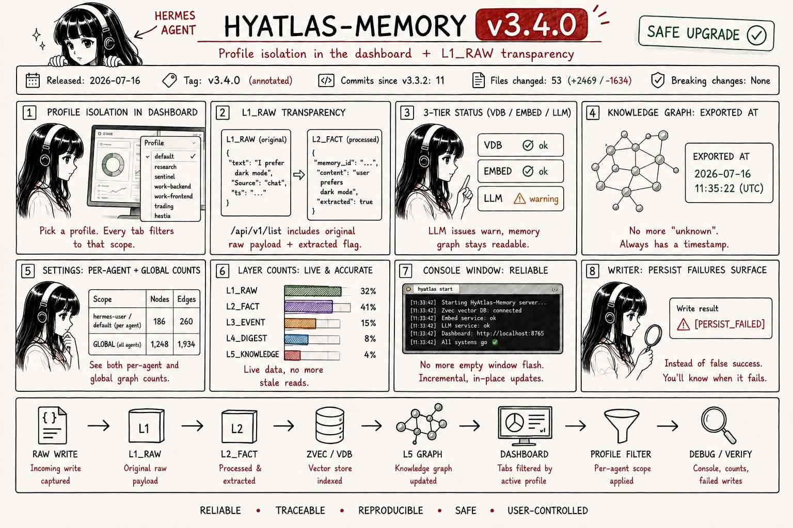
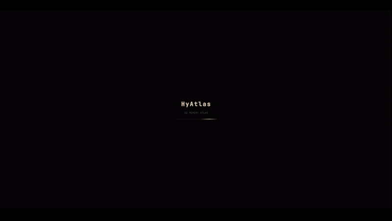
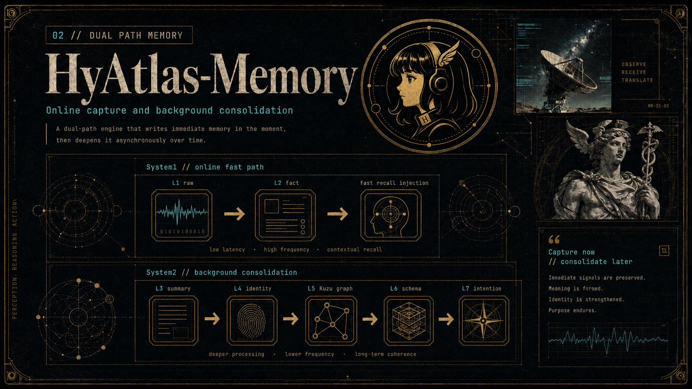
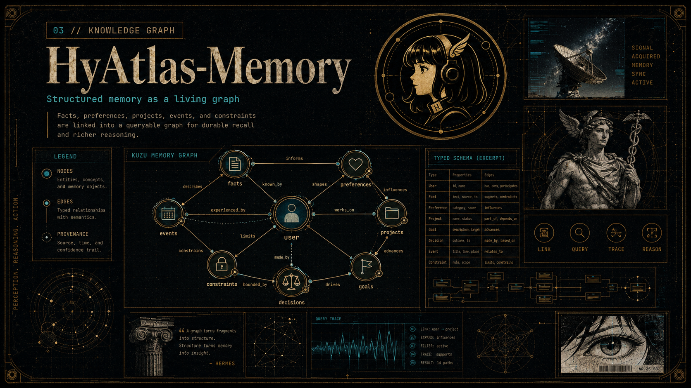
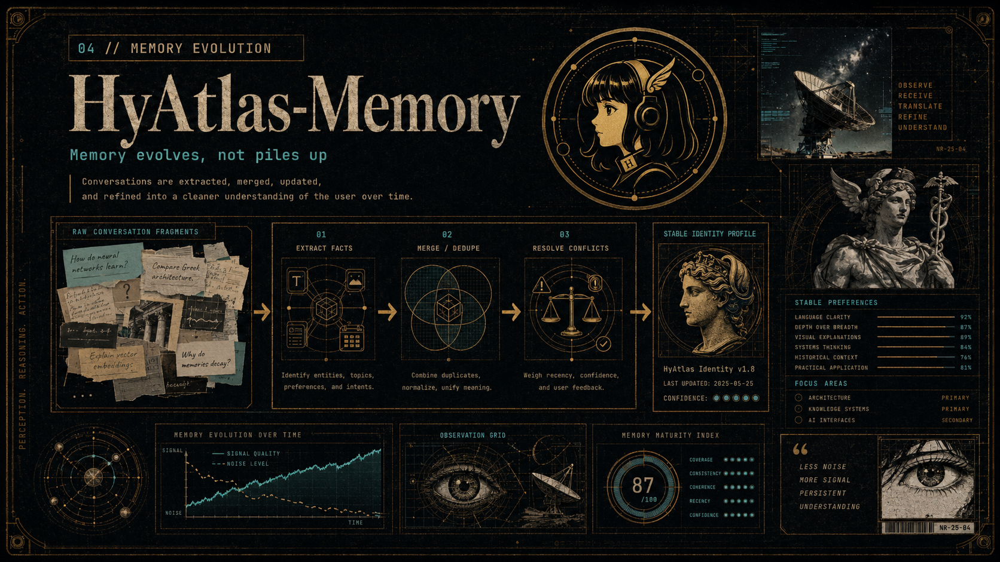

# HyAtlas-Memory

A personal, local, single-user long-term memory stack for Hermes Agent — built by forking the Hy-Memory 7-layer cognitive memory framework (Tencent Hunyuan) and refining it into something tuned for one person's daily, multi-session use. Includes the experimental L7 intention layer. Apache 2.0 licensed.

> **v3.4.0** — Profile isolation lands in the dashboard: pick a profile (default, research, sentinel, work-backend, work-frontend, trading, hestia) and every tab filters to that scope. Plus L1_RAW transparency (`include_raw` flag on `/api/v1/list`), 3-tier status (vdb/embed/llm), and a long list of dashboard truth fixes. See [CHANGELOG](./CHANGELOG.md).

<p align="center">
  
</p>

<p align="center">
  <a href="https://tuancookiez-hub.github.io/portfolio/"></a>
  <a href="./LICENSE"></a>
  <a href="https://github.com/tuancookiez-hub/HyAtlas-Memory/releases"></a>
</p>

<p align="center">
  
</p>

## What it is

Hermes Agent is powerful. You tell it your preferences, your project structure, your coding conventions, but all of this only fits into 2200 char memory.md by default which is small. 

HyAtlas-Memory fixes this. It's a memory provider plugin that drops into Hermes Agent and gives it **persistent, structured memory across sessions**. After a few conversations, your agent knows your name, your stack, your working style, your active projects, and the decisions you've made — without you repeating yourself.

It doesn't just store raw text either. Every message you send flows through a pipeline that extracts facts, resolves conflicts, builds a knowledge graph, and stabilizes a long-term identity profile. The more you use it, the sharper the agent's understanding becomes.

**Three things happen automatically:**

1. **It remembers.** Every conversation is captured, broken into atomic facts, and stored across 7 memory layers.
2. **It recalls.** When you start a new message, relevant memories are injected into the agent's context before it responds — no tool call needed.
3. **It evolves.** Background processing merges duplicates, resolves contradictions, and refines the agent's model of you over time.

See it in action — a 19-second walkthrough of the live dashboard:

<p align="center">
  
</p>

## Quick start

```bash
git clone https://github.com/tuancookiez-hub/HyAtlas-Memory.git
cd HyAtlas-Memory
pip install -e .
hyatlas setup hermes        # installs plugin + config + tests auto-start
```

That's it. The first time you run Hermes after setup, the provider automatically starts the **memory server** and **dashboard** in the background ( **Zvec** in-process — no Qdrant sidecar by default).

**Hermes + evolution:** see [docs/HYATLAS_HERMES.md](docs/HYATLAS_HERMES.md) (identity `hermes-user` / `default`, weekly digest, L6 in graph).

**If you want to see what's happening:**

```bash
hyatlas start           # start the stack (safe to Ctrl+C after "ready")
hyatlas console         # open the live status window (Ctrl+C to close)
hyatlas stop            # shut down the stack
```

> **`hyatlas start` is safe to close.** Once you see "ready", Ctrl+C or close the terminal — the services keep running detached. Use `hyatlas stop` when you actually want to shut them down.
>
> **`hyatlas console`** is read-only. Shows live service health and recent memory activity (writes, recalls, errors). Closing it does NOT stop the stack.

**Vector store:** **Zvec** is the default (v3.1+). No separate binary or port. Qdrant is **migration/archive only** — see [docs/CLEANUP.md](docs/CLEANUP.md) and `hyatlas archive qdrant`.

**Want Docker instead?** See [Path A — Docker (legacy)](#path-a--docker-legacy-qdrant-compose) below.

**Configure (optional):** edit `~/.hyatlas/config/hy_memory.json` to add your LLM key:

```json
{
  "llm": {
    "api_key": "YOUR_LLM_API_KEY_HERE",
    "model": "gpt-4o-mini",
    "base_url": "https://api.openai.com/v1"
  },
  "embedder": {
      "model": "BAAI/bge-large-en-v1.5",
      "dims": 1024,
      "provider": "local"
    },
  "mode": "ultra",
  "vector_store": {"provider": "zvec", "host": "127.0.0.1", "port": 6333}
}
```

> **Three modes:** `lite` (no LLM, embedding-only) · `pro` (LLM extraction per `add`) · `ultra` (pro + System 2 cognitive layer with Kuzu graph — default).

> **New in 3.0:** Full SDK fork (no external `hy-memory` dependency), reasoning model compatibility (think-block parsing for MiniMax-M3/DeepSeek-R1), emotion-aware memory strength, Kuzu WAL checkpoint fix, 23 patches → 13 first-class integrations. See [CHANGELOG.md](CHANGELOG.md) for the full diff vs 2.1.0.

---

### Path A — Docker (legacy Qdrant compose)

> **Prefer native:** `hyatlas start` (Zvec). The compose file is kept for **migration reference** only — see header in `docker-compose.yml`.

For users who still run the old Qdrant-based compose:

```bash
# 1. Get docker-compose.yml (one-time)
curl -O https://raw.githubusercontent.com/tuancookiez-hub/HyAtlas-Memory/main/docker-compose.yml

# 2. Configure your LLM key (one-time)
echo 'HY_MEMORY_LLM_API_KEY=***' > .env

# 3. Start the stack (legacy: Qdrant + server + dashboard)
docker-compose up -d

# 4. Wait ~15s, then verify
curl http://127.0.0.1:8765/api/health
curl http://127.0.0.1:19527/info

# 5. Open the dashboard
open http://127.0.0.1:8765
```

**Common commands:**

```bash
docker-compose ps           # what's running
docker-compose logs -f      # follow all logs (Ctrl+C to exit)
docker-compose restart      # restart everything
docker-compose down         # stop (keeps data)
docker-compose down -v      # stop AND wipe all data
```

Data lives in `./qdrant_storage` and `~/.hyatlas` (mounted to the host), so it survives `docker-compose down`. To fully reset, use `down -v`.

### What's running where

| Service | Port | URL | Purpose |
|---|---|---|---|
| Zvec (in-process) | — | (no HTTP) | Default vector store (v3.1+) |
| Upstream hy-memory | 19527 | `http://127.0.0.1:19527/info` | Embedding + LLM extraction + search + graph |
| HyAtlas dashboard | 8765 | `http://127.0.0.1:8765` | Web UI: explore, observe, manage |

Legacy Qdrant sidecar (compose / migration only): port **6333**.

The dashboard is the main thing you'll interact with. The other two are infrastructure.

---

### Next: see your memories

Once running, your conversations automatically start filling the system with memories. To explore what's been captured:

1. Open the dashboard at `http://127.0.0.1:8765`
2. **Overview** — KPIs (total memories, by-layer breakdown, recent activity)
3. **Memory Observatory** — visual 3D graph of your memory corpus
4. **Explore Memory** — semantic search across all 7 layers
5. **Layers / Today / Settings / L5 Knowledge Graph** — deeper views

Logs go to `logs/` in the project root (local) or `docker-compose logs -f` (Docker).

### Memory recall is transparent

When your agent receives a message, HyAtlas-Memory injects relevant memories into the prompt as a `<relevant-memories>` block. The agent sees your past context without you doing anything.

### Search tool

Agents (or you in the TUI) can explicitly search memories:

```text
> /hy_memory_search preferences
[profile] User is Tuan, prefers direct action
[profile] User uses Hermes Agent
[normal] Working on HyAtlas extraction (2026-06-16)
```

### CLI

**Stack management** — the bundled `hyatlas` entry point:

```bash
hyatlas start           # start server + dashboard (Zvec; no Qdrant by default)
hyatlas stop            # stop all services
hyatlas status          # check what's running
hyatlas console         # open live status window (Ctrl+C to close)
hyatlas doctor          # full health check
hyatlas setup hermes    # install plugin + config
hyatlas init            # interactive setup wizard
hyatlas --help          # show help
```

> **`hyatlas start`** — services run **detached**, so it's safe to Ctrl+C or close the terminal window once you see "ready". Use `hyatlas stop` when you actually want to shut down.
>
> **`hyatlas console`** — read-only status window. Shows service health and live memory activity (writes, recalls, errors). Closing it does **not** stop the stack.

**Memory operations** — read/write memories from any shell, cron job,
or another session. Mirrors Hindsight's `retain|recall|reflect` and
Memories.sh's `add|search|recall` patterns:

```bash
hyatlas memory write    "the fact to remember"
hyatlas memory recall   "your search query" --limit 5
hyatlas memory list     [--layer l2_fact] [--limit 20]
hyatlas memory reflect  "your query" --limit 10
hyatlas memory status

# Aliases for muscle memory:
hyatlas memory add      "..."    # same as write
hyatlas memory retain   "..."    # same as write (Hindsight-style)
hyatlas memory search   "..."    # same as recall
hyatlas memory find     "..."    # same as recall
hyatlas memory ls                   # same as list
```

The `write` command goes through the same LLM fact-extraction pipeline
as a Hermes conversation turn, so the memory lands in **Zvec** with proper
`layer`, `importance`, and `access_count` populated.

The `reflect` command outputs the exact `<relevant-memories>` block the
agent would inject into the system prompt for the same query — useful
for debugging recall quality.

**Provider config** — Hermes Agent's memory command:

```bash
hermes memory status   # show current memory provider config
hermes memory setup    # interactive provider selection
hermes memory off      # disable external provider
hermes memory reset    # erase built-in MEMORY.md / USER.md (NOT VDB)
```

### Manually writing memories from another session

If you prefer Python over a shell command (e.g., from a cron job, an
agent script, or Jupyter):

```python
from hyatlas_memory import HyMemoryProvider

provider = HyMemoryProvider()
provider.initialize(
    session_id="my-session-id",
    user_id="hermes-user",
    agent_identity="default",
)

provider.sync_turn(
    user_content="The user prefers Vue 3 + Composition API for new projects.",
    assistant_content="Noted.",
    session_id="my-session-id",
)
```

The upstream `hy-memory` server handles LLM-based fact extraction,
importance scoring, and vector indexing automatically. ~8s indexing
delay before the memory shows on the dashboard.

For thin-client control (no provider, just the HTTP wrapper):

```python
result = provider._client.add(
    data=[{"role": "user", "content": "..."}, {"role": "assistant", "content": "..."}],
    user_id="hermes-user",
    agent_id="default",
    session_id="my-session-id",
)
```

**Important:** `user_id` and `agent_identity` must match your Hermes
profile. The default is `hermes-user` for the main profile.

## How it works

Memory flows through two parallel paths — a fast path for real-time awareness, and a slow path for deep consolidation:

<p align="center">
  
</p>

**System 1 — Fast Path** handles every message you send. It captures raw text, extracts atomic facts via LLM, and injects relevant context back into the agent. This happens in milliseconds — you never wait for memory.

**System 2 — Background Consolidation** runs on **digest** (manual or cron). It clusters fresh **L2** facts into **L5** knowledge, **L6** behavioral schemas, and **L7** intentions in Kuzu. L4 identity is **retired** — preferences live in L2 + L6.

## The 7 memory layers

Canonical reference: **[docs/LAYERS.md](docs/LAYERS.md)**. Summary:

| Layer | Purpose | Store |
|-------|---------|-------|
| **L0** | Profile snippets | Zvec |
| **L1** | Raw / shadow ingest | Zvec (often 0 under Hermes key) |
| **L2** | Atomic facts (capture) | Zvec |
| **L3** | Summaries / rollups | Zvec |
| **L4** | **Retired** identity VDB | Legacy rows only |
| **L5** | Knowledge graph | Kuzu |
| **L6** | Behavioral schemas | Kuzu |
| **L7** | Intentions (experimental) | Kuzu |

### Retrieval scoring (4-factor MemoryScorer)

The upstream `hy-memory` server ships a 4-factor `MemoryScorer` that ranks recalled memories:

```
0.50 × semantic    (vector similarity)
+ 0.30 × recency    (decay over time)
+ 0.15 × importance (per-memory score, this layer)
+ 0.05 × access     (recall-count boost)
```

HyAtlas-Memory populates the `importance` and `access` factors that upstream leaves zero by default, so the full scorer is active out of the box.

| Field | How it's populated | Default |
|---|---|---|
| `importance` | Layer-derived: `l2_fact=0.8`, `l3_summary=0.6`, `l0_basic_info=0.5`, `l1_raw=0.3` (legacy `l4_identity=1.0` if present) | **ON** |
| `access_count` | Incremented on every recall (fire-and-forget thread) | **ON** |

Both run on existing points too — a one-shot backfill (`scripts/backfill_importance.py`) populates them across the corpus, and new memories pick them up automatically on write.

**Disable either** with `=0`:

```bash
HYATLAS_MEMORY_IMPORTANCE=0    # disable layer-as-importance
HYATLAS_MEMORY_ACCESS_COUNT=0  # disable access-count tracking
```

No LLM cost. No added latency. Just better recall ordering — high-priority identity/fact memories no longer get outranked by raw fragments.

### Knowledge graph

The L5 pipeline builds a living graph of entities and their relationships — not just keyword matches, but typed semantic connections you can query:

<p align="center">
  
</p>

The graph centers on the user and connects to facts, preferences, projects, events, goals, decisions, and constraints — each with typed edges like "works on", "likes", "drives", "limited by". You can query it directly:

- What are the user's top priorities?
- Show all constraints affecting Project X.
- What decisions influenced Goal Y?

## Memory evolution

HyAtlas-Memory doesn't just accumulate — it refines. Each `add` flows through a deterministic evolution pipeline:

1. **Extract** — pull atomic facts, entities, and context from new material
2. **Merge / dedupe** — combine duplicates, normalize, unify meaning
3. **Resolve conflicts** — weigh recency, confidence, and user feedback
4. **Stabilize identity** — update the long-term profile only when confidence crosses a threshold

The result is a signal-to-noise ratio that improves with every session. Raw conversation fragments get distilled into a small, queryable, evolving model of the user.

<p align="center">
  
</p>

## Architecture

```text
   ┌──────────── Hermes Agent CLI / TUI ────────────┐
   │                                                │
   │   conversation →  MemoryProvider interface     │
   │                          │                     │
   └──────────────────────────┼─────────────────────┘
                              ▼
   ┌────────── HyAtlas-Memory (this package) ──────────┐
   │                                                    │
   │   L1 raw  →  L2 fact  →  L3 summary (every 20)    │
   │       │           │              │                 │
   │       └───── L4 identity  ◄──────┘                 │
   │                  │                                 │
   │            L5 pipeline (async, Kuzu graph)         │
   │            L6 schema                              │
   │            L7 intention (proactive)                │
   │                                                    │
   └────────────────────────────────────────────────────┘
```

### Source layout

```text
src/hyatlas_memory/        # the plugin (Python package)
  __init__.py              # HyMemoryProvider — entry point, registers with Hermes
  __main__.py              # `python -m hyatlas_memory` entry
  _start.py                # full stack startup logic (bundled for `hyatlas` CLI)
  _version.py              # version string (no-dep import)
  client.py                # HTTP client to the local server (urllib, zero deps)
  integrations.py          # 13 first-class integrations (circuit breaker, L5, graph endpoint, etc.)
  context_pressure.py      # 4-tier token budget monitor (fastpath → emergency)
  process.py               # subprocess lifecycle for the local server
  embed_server.py          # local SentenceTransformers embedder (OpenAI-compatible)
  init_wizard.py           # first-run interactive setup wizard
  installer.py             # one-time pip-deps installer
  cli.py                   # `hermes hy-memory doctor|add|search|list|init|reset`
  start.py                 # thin wrapper for `hyatlas` console_scripts entry
  l5_inprocess.py          # L5 knowledge graph extraction (entity/relation → Kuzu)
  plugin.yaml              # legacy plugin manifest (kept for back-compat)
  layout.py                # HYATLAS_HOME path resolver + config loading
  config_cli.py            # `hyatlas config` CLI commands
  core/                    # forked hy-memory 1.2.20 SDK (42,668 lines, first-party)
    agent/                 # extractor, reconciler, abstractor, emotion analyzer, LLM provider
    client.py              # HyMemoryClient — the core memory engine
    config.py              # MemoryConfig + LLM/embedder/vector config
    core/                  # embed service, merger, scorer
    data/                  # Zvec store, Kuzu graph, cache, history
    models/                # memory + request data models
    pipelines/             # writer, readers (legacy/hybrid_v2/hybrid_tag), system2 agent
    server.py              # HTTP server (port 19527)
    utils/                 # audit log, token counting, language detection, tracing

server/                    # standalone server launcher
  start_server.py          # reads hy_memory.json + .env, starts core server
  bin/                     # L5 pipeline scripts (7-step graph rebuild)
  dashboard/               # local web UI (port 8765)
    dashboard.html         # HTML shell + page templates
    dashboard.py           # http server, auth, API endpoints
    app.js                 # shared state, navigation, overview, explore, layers, today, system
    styles.css             # all CSS
    js/l5.js               # L5 Knowledge Graph page
    js/observatory.js      # Three.js memory observatory (split from app.js for size)

tests/                     # pytest suite (47 tests)
scripts/                   # one-off ops scripts
docs/                      # architecture + migration notes
assets/                    # infographic images
```

### How the pieces fit

- **Plugin** (`src/hyatlas_memory/`) is a thin client. It implements the `MemoryProvider` interface that Hermes Agent calls. It doesn't do heavy lifting — it talks to a local server over HTTP.
- **Server** (auto-started on port 19527) runs the forked hy-memory SDK (`src/hyatlas_memory/core/`). This is where embedding, LLM extraction, and vector search happen. The plugin manages its lifecycle as a subprocess.
- **L5 pipeline** (`l5_inprocess.py`) runs in-process — entity/relation extraction writes directly to Kuzu without a batch lock. The dashboard's graph tab reads live from the server's `/api/v1/graph` endpoint.
- **Context pressure** (`context_pressure.py`) monitors the agent's context window. At 50% usage it starts compressing old tool outputs to ref files. At 95% it aggressively prunes to prevent overflow.
- **Integrations** (`integrations.py`) are 13 first-class modules applied at import time: VDB circuit breaker, L1_RAW rolling delete/dedup, L5 auto-trigger + in-process extraction, graph endpoint, L5/L6/L7 counts, S1 L5 context, user identity alias expansion, LLM fast/smart split, DisabledCache tolerance, rerank stage, and L1_RAW normal fallback. Each is idempotent and documented inline. The active set is logged at startup.

## Documentation

- **[docs/HYATLAS_HERMES.md](docs/HYATLAS_HERMES.md)** — Hermes identity, digest cron, L6 proof
- **[docs/CLEANUP.md](docs/CLEANUP.md)** — Post-zvec disk/repo cleanup
- **[docs/DASHBOARD.md](docs/DASHBOARD.md)** — Web UI reference (all 6 pages, Observatory controls, animations)
- **[docs/API.md](docs/API.md)** — HTTP API reference (every endpoint, request/response shapes)
- **[docs/LAYERS.md](docs/LAYERS.md)** — Per-layer deep-dive (L0–L7: what, where, when)
- **[docs/architecture.md](docs/architecture.md)** — System design + layer mapping vs official spec
- **[docs/TROUBLESHOOTING.md](docs/TROUBLESHOOTING.md)** — Common issues + fixes
- **[CONTRIBUTING.md](CONTRIBUTING.md)** — How to contribute, dev setup, PR process
- **[CHANGELOG.md](CHANGELOG.md)** — Version history

## Development

```bash
# 1. Clone + editable install
git clone https://github.com/tuancookiez-hub/HyAtlas-Memory.git
cd HyAtlas-Memory
pip install -e ".[dev,test]"

# 2. Run tests
pytest                     # 33 tests pass offline, 19 skipped (need live server)
pytest -m integration      # integration tests; needs `hyatlas start` (Zvec + server)

# 3. Lint
ruff check .
mypy src/

# 4. Live reload during plugin dev
pip install -e . --force-reinstall
```

## Migration from in-fork plugin

If you were running the previous in-fork version (`plugins/memory/hy_memory/` inside the hermes-agent fork):

```bash
# 1. Backup the old plugin dir
mv hermes-agent/plugins/memory/hy_memory ~/hy_memory_archive_$(date +%Y%m%d)

# 2. Install this package
git clone https://github.com/tuancookiez-hub/HyAtlas-Memory.git
cd HyAtlas-Memory
pip install -e .

# 3. Your config and data stay where they were
#    ~/.hyatlas/        (config, data, logs, Kuzu DB, Zvec store)
#    ~/.hyatlas/config/hy_memory.json  (config)
```

No data migration needed for the in-fork → package move. The Kuzu graph at `~/.hyatlas/data/kuzu_db` (or legacy `~/.hy_memory/data/kuzu_db`) is forward-compatible. The integrations from the fork are now part of the package, applied at import time via the `integrations.py` module.

> **Upgrading 2.x → 3.0?** The v3.0.0 release forks the full hy-memory SDK into first-party code. No external `hy-memory` pip dependency needed. Your existing Qdrant data and Kuzu graph are forward-compatible. If you have issues, `git checkout v2.1.0-stable` restores the pre-fork state.

## License

Apache 2.0. See `LICENSE`.

## Credits

Built by [TunaDev](https://tuancookiez-hub.github.io/portfolio/). Architecture inspired by the [Hy-Memory framework](https://memory.hunyuan.tencent.com) (Tencent Hunyuan) and the cognitive-architecture literature on dual-process theory (Kahneman's System 1 / System 2). The L7 intention layer is an independent extension not part of the official spec.

Uses:

- [Zvec](https://github.com/alibaba/zvec) — default in-process vector store (v3.1+)
- [Kuzu](https://kuzudb.com/) — embedded graph database (L5–L7 graph)
- [Qdrant](https://qdrant.tech/) — migration/archive source only at runtime
- [SentenceTransformers](https://www.sbert.net/) — local embedding model
- [Hermes Agent](https://github.com/NousResearch/hermes-agent) — the host agent runtime

**Not affiliated with Tencent.** HyAtlas-Memory is an independent project; the Hy-Memory name is referenced to credit the architectural inspiration.
