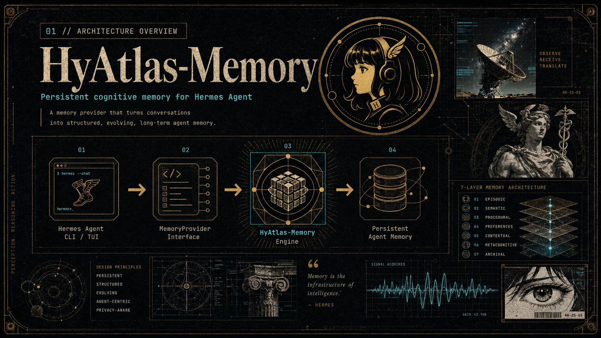

# HyAtlas-Memory

> **This is a community implementation of the official [Hy-Memory](https://memory.hunyuan.tencent.com) framework by Tencent Hunyuan.** It is one of three supported entry points (alongside OpenClaw and OpenCode) and is targeted specifically at [Hermes Agent](https://github.com/NousResearch/hermes-agent). For the canonical 6-layer model, the three operating modes (Lite / Pro / Ultra), and the evolution chain specification, see the [official documentation](https://memory.hunyuan.tencent.com). This implementation extends the official 6-layer model with an **experimental 7th layer (L7 = intention)** for proactive intent detection; see [`docs/architecture.md`](docs/architecture.md) for the local extension notes.

> A 7-layer cognitive memory for [Hermes Agent](https://github.com/NousResearch/hermes-agent), with System1/System2 dual processing, evolution chains, and a Kuzu graph backend.

<p align="center">
  <a href="https://tuancookiez-hub.github.io/tuandev-portfolio/"></a>
  <a href="./LICENSE"></a>
</p>

<p align="center">
  
</p>

```text
   ┌──────────── Hermes Agent CLI / TUI ────────────┐
   │                                                │
   │   conversation →  MemoryProvider interface     │
   │                          │                     │
   └──────────────────────────┼─────────────────────┘
                              ▼
   ┌────────── HyAtlas-Memory (this package) ──────────┐
   │                                                    │
   │   L1 raw  →  L2 fact  →  L3 summary (every 20)    │
   │       │           │              │                 │
   │       └───── L4 identity  ◄──────┘                 │
   │                  │                                 │
   │            L5 pipeline (async, Kuzu graph)         │
   │            L6 schema                              │
   │            L7 intention (proactive)                │
   │                                                    │
   └────────────────────────────────────────────────────┘
```

## What it is

HyAtlas-Memory turns your Hermes Agent into something that **remembers and learns across sessions**. Instead of each chat being a blank slate, your agent accumulates a structured 7-layer memory:

| Layer | Purpose | Triggers |
|-------|---------|----------|
| **L1 raw** | Verbatim session entries, time-ordered | every `add` |
| **L2 fact** | Atomic facts extracted by LLM | every `add` |
| **L3 summary** | Periodic L2 rollups (coherent narratives) | every 20 adds |
| **L4 identity** | Long-lived user/agent facts (preferences, persona) | automatic |
| **L5 pipeline** | Async ingest into Kuzu graph for relational queries | background |
| **L6 schema** | Typed entity/relationship schema | L5 step |
| **L7 intention** | Proactive intent detection, async tasks | L5 step |

<p align="center">
  
</p>

Three modes:

- **`lite`** — embedding-only, zero LLM cost (free, fast)
- **`pro`** — LLM fact extraction + reconciliation
- **`ultra`** — pro + System2 cognitive layer with Kuzu graph (default; the most powerful)

## Install

```bash
# 1. Install alongside Hermes Agent
pip install hermes-agent          # if not already installed
pip install hyatlas-memory        # this package

# 2. Edit ~/.hermes/config.yaml
memory:
  provider: hy_memory
```

That's it. On first launch, HyAtlas-Memory will:

1. Auto-create `~/.hy_memory/` (data dir)
2. Initialize the Kuzu graph store
3. Prompt for one-time setup (vector store choice, LLM key)
4. Start the local server on port 19527

## Configure

Copy `hy_memory.json.example` to `~/.hy_memory/hy_memory.json`:

```json
{
  "llm": {
    "api_key": "YOUR_LLM_API_KEY_HERE",
    "model": "gpt-4o-mini",
    "base_url": "https://api.openai.com/v1"
  },
  "embedder": {
    "model": "BAAI/bge-small-en-v1.5",
    "dims": 384,
    "provider": "local"
  },
  "mode": "ultra",
  "vector_store": {
    "provider": "qdrant",
    "host": "127.0.0.1",
    "port": 6333
  }
}
```

Vector store options: `qdrant` (default, fastest), `chroma` (simplest), `faiss` (no daemon).

LLM options: any OpenAI-compatible endpoint. Tested with OpenAI, OpenRouter, TokenRouter, DeepSeek, MiniMax, ByteDance. Use `base_url` to point to a local Ollama instance.

## Use

The plugin integrates automatically with Hermes Agent. Three things happen:

### 1. Recalls happen transparently

When your agent receives a user message, HyAtlas-Memory automatically injects relevant memories into the prompt as a `<relevant-memories>` block. You don't need to call any tool — it just works.

### 2. The `hy_memory_search` tool is available

Agents (or you in the TUI) can explicitly recall:

```text
> /hy_memory_search preferences
[profile] User is Tuan, prefers direct action
[profile] User uses Hermes Agent
[normal] Working on HyAtlas extraction (2026-06-16)
```

### 3. The dashboard shows everything

```bash
python -m server.dashboard.dashboard
# open http://127.0.0.1:8765
```

7 tabs: Overview, Explore, Layers, Today, Graph, Activity, Settings. Reads the live server, no setup.

## Architecture

```text
src/hyatlas_memory/        # the plugin (Python package)
  __init__.py              # HyMemoryProvider (entry point)
  client.py                # HTTP client to the local server
  patches.py               # the 9 carried patches (L1 dedup, L3 trigger, etc.)
  context_pressure.py      # System2 context-budget enforcement
  process.py               # subprocess management for the local server
  embed_server.py          # local sentence-transformers embedder
  init_wizard.py           # first-run setup wizard
  installer.py             # one-time pip-deps install
  cli.py                   # `python -m hyatlas_memory ...`
  plugin.yaml              # legacy plugin manifest (kept for back-compat)

server/                    # standalone server (auto-started by plugin)
  start_server.py          # uvicorn launcher
  bin/                     # L5 pipeline scripts
  dashboard/               # local web UI

tests/                     # pytest suite
docs/                      # architecture + migration notes
assets/                    # icons, banner
```

<p align="center">
  
</p>

## Memory evolution

HyAtlas-Memory does not just append — it refines. Each `add` flows through a small, deterministic evolution pipeline that turns fragments of conversation into a stable identity profile:

1. **Extract** entities, topics, preferences, intents from the new material.
2. **Merge / dedupe** against existing facts (normalise, unify meaning).
3. **Resolve conflicts** by weighing recency, confidence, and user feedback.
4. **Update the stable identity profile** only when a value crosses a confidence threshold.

The result is a signal/noise ratio that improves with every session rather than degrading. By the time the system has seen a few hundred interactions, raw conversation fragments have been distilled into a small, queryable, *evolving* model of the user.

<p align="center">
  
</p>

## Development

```bash
# 1. Clone + editable install
git clone https://github.com/tuancookiez-hub/HyAtlas-Memory.git
cd HyAtlas-Memory
uv pip install -e ".[dev,test]"

# 2. Run tests
pytest                     # 12 tests, ~0.1s, no external deps
pytest -m integration      # needs running HyAtlas server

# 3. Lint
ruff check .
mypy src/

# 4. Live reload during plugin dev
uv pip install -e . --force-reinstall
```

## Migration from in-fork plugin

If you were running the previous in-fork version (`plugins/memory/hy_memory/` inside the hermes-agent fork):

```bash
# 1. Backup the old plugin dir
mv hermes-agent/plugins/memory/hy_memory ~/hy_memory_archive_$(date +%Y%m%d)

# 2. Install this package
pip install hyatlas-memory

# 3. Your config and data stay where they were
#    ~/.hy_memory/      (data, Kuzu DB)
#    ~/.hy_memory.json  (config) -- the new package reads this unchanged
```

No data migration needed. The Kuzu graph at `~/.hy_memory/data/kuzu_db` is forward-compatible. The 9 carried patches from the fork are now part of the package, applied at import time via the `patches.py` module.

## License

MIT. See `LICENSE`.

## Credits

Built on the [official Hy-Memory framework](https://memory.hunyuan.tencent.com) by **Tencent Hunyuan**. This community implementation targets the [Hermes Agent](https://github.com/NousResearch/hermes-agent) runtime; the official framework also provides integrations for OpenClaw and OpenCode via the same SDK.

Uses:

- [Kuzu](https://kuzudb.com/) — embedded graph database (L1 raw + L5 graph)
- [Qdrant](https://qdrant.tech/) / [Chroma](https://www.trychroma.com/) / [FAISS](https://faiss.ai/) — vector store backends
- [SentenceTransformers](https://www.sbert.net/) — local embedding model
- [Hermes Agent](https://github.com/NousResearch/hermes-agent) — the host agent runtime

Architecture inspired by the cognitive-architecture literature on dual-process theory (Kahneman's System 1 / System 2) and by existing systems in the same family (Mnemosyne, Hindsight, OpenClaw's mem-agent).

**Not affiliated with Tencent.** HyAtlas-Memory is an independent community project; the Hy-Memory name and the 6-layer model are referenced here for source-of-truth accuracy and to credit the canonical design.
