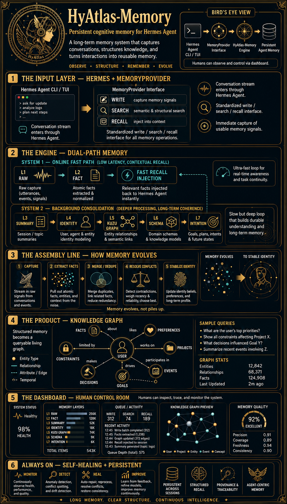

# HyAtlas-Memory

> A 7-layer cognitive memory for [Hermes Agent](https://github.com/NousResearch/hermes-agent), with System1/System2 dual processing, evolution chains, and a Kuzu graph backend.

<p align="center">
  <a href="https://tuancookiez-hub.github.io/tuandev-portfolio/"></a>
  <a href="./LICENSE"></a>
</p>

<p align="center">
  
</p>

## What it is

Hermes Agent is powerful, but every conversation starts from zero. You tell it your preferences, your project structure, your coding conventions — and by the next session, it's forgotten all of it.

HyAtlas-Memory fixes this. It's a memory provider plugin that drops into Hermes Agent and gives it **persistent, structured memory across sessions**. After a few conversations, your agent knows your name, your stack, your working style, your active projects, and the decisions you've made — without you repeating yourself.

It doesn't just store raw text either. Every message you send flows through a pipeline that extracts facts, resolves conflicts, builds a knowledge graph, and stabilizes a long-term identity profile. The more you use it, the sharper the agent's understanding becomes.

**Three things happen automatically:**

1. **It remembers.** Every conversation is captured, broken into atomic facts, and stored across 7 memory layers.
2. **It recalls.** When you start a new message, relevant memories are injected into the agent's context before it responds — no tool call needed.
3. **It evolves.** Background processing merges duplicates, resolves contradictions, and refines the agent's model of you over time.

## How it works

Memory flows through two parallel paths — a fast path for real-time awareness, and a slow path for deep consolidation:

<p align="center">
  
</p>

**System 1 — Fast Path** handles every message you send. It captures raw text, extracts atomic facts via LLM, and injects relevant context back into the agent. This happens in milliseconds — you never wait for memory.

**System 2 — Background Consolidation** runs asynchronously. It takes the accumulated facts and builds something deeper: session summaries, identity profiles, a relationship graph, domain schemas, and proactive intent detection. This is where raw data becomes understanding.

## Quick start

```bash
# 1. Install alongside Hermes Agent
pip install hermes-agent          # if not already installed
pip install hyatlas-memory        # this package

# 2. Edit ~/.hermes/config.yaml
memory:
  provider: hy_memory
```

That's it. On first launch, HyAtlas-Memory will:

1. Auto-create `~/.hy_memory/` (data directory)
2. Initialize the Kuzu graph store
3. Prompt for one-time setup (vector store choice, LLM key)
4. Start a local server on port 19527

### Configuration

Copy `hy_memory.json.example` to `~/.hy_memory/hy_memory.json`:

```json
{
  "llm": {
    "api_key": "YOUR_LLM_API_KEY_HERE",
    "model": "gpt-4o-mini",
    "base_url": "https://api.openai.com/v1"
  },
  "embedder": {
    "model": "BAAI/bge-small-en-v1.5",
    "dims": 384,
    "provider": "local"
  },
  "mode": "ultra",
  "vector_store": {
    "provider": "qdrant",
    "host": "127.0.0.1",
    "port": 6333
  }
}
```

**Vector store options:** `qdrant` (default, fastest), `chroma` (simplest), `faiss` (no daemon).

**LLM options:** any OpenAI-compatible endpoint. Tested with OpenAI, OpenRouter, TokenRouter, DeepSeek, MiniMax, ByteDance. Use `base_url` to point to a local Ollama instance.

**Three modes:**

| Mode | What it does | Cost |
|------|-------------|------|
| `lite` | Embedding-only, zero LLM calls | Free |
| `pro` | LLM fact extraction + reconciliation | LLM calls per `add` |
| `ultra` | Pro + System2 cognitive layer with Kuzu graph (default) | LLM calls + background pipeline |

## Using it

The plugin integrates automatically with Hermes Agent — no manual tool calls needed.

### Memory recall is transparent

When your agent receives a message, HyAtlas-Memory injects relevant memories into the prompt as a `<relevant-memories>` block. The agent sees your past context without you doing anything.

### Search tool

Agents (or you in the TUI) can explicitly search memories:

```text
> /hy_memory_search preferences
[profile] User is Tuan, prefers direct action
[profile] User uses Hermes Agent
[normal] Working on HyAtlas extraction (2026-06-16)
```

### Dashboard

```bash
python -m server.dashboard.dashboard
# open http://127.0.0.1:8765
```

7 tabs: Overview, Explore, Layers, Today, Graph, Activity, Settings. Reads the live server — no setup, no config.

### CLI

```bash
hermes hy-memory doctor    # health check
hermes hy-memory add       # manually add a memory
hermes hy-memory search    # manual search
hermes hy-memory list      # list recent memories
hermes hy-memory init      # interactive setup wizard
hermes hy-memory reset     # erase all memories (destructive)
```

## The 7 memory layers

Every piece of memory lives in one of seven layers, each with a specific purpose and trigger:

| Layer | Purpose | Triggers |
|-------|---------|----------|
| **L1 raw** | Verbatim session entries, time-ordered | every `add` |
| **L2 fact** | Atomic facts extracted by LLM | every `add` |
| **L3 summary** | Periodic L2 rollups (coherent narratives) | every 20 adds |
| **L4 identity** | Long-lived user/agent facts (preferences, persona) | automatic |
| **L5 pipeline** | Async ingest into Kuzu graph for relational queries | background |
| **L6 schema** | Typed entity/relationship schema | L5 step |
| **L7 intention** | Proactive intent detection, async tasks | L5 step |

L1–L2 run on the fast path (every message). L3–L7 run on the background path (async). L7 is an experimental extension — proactive intent detection that surfaces follow-up questions and task suggestions the agent should consider.

### Knowledge graph

The L5 pipeline builds a living graph of entities and their relationships — not just keyword matches, but typed semantic connections you can query:

<p align="center">
  
</p>

The graph centers on the user and connects to facts, preferences, projects, events, goals, decisions, and constraints — each with typed edges like "works on", "likes", "drives", "limited by". You can query it directly:

- What are the user's top priorities?
- Show all constraints affecting Project X.
- What decisions influenced Goal Y?

## Memory evolution

HyAtlas-Memory doesn't just accumulate — it refines. Each `add` flows through a deterministic evolution pipeline:

1. **Extract** — pull atomic facts, entities, and context from new material
2. **Merge / dedupe** — combine duplicates, normalize, unify meaning
3. **Resolve conflicts** — weigh recency, confidence, and user feedback
4. **Stabilize identity** — update the long-term profile only when confidence crosses a threshold

The result is a signal-to-noise ratio that improves with every session. Raw conversation fragments get distilled into a small, queryable, evolving model of the user.

<p align="center">
  
</p>

## Architecture

```text
   ┌──────────── Hermes Agent CLI / TUI ────────────┐
   │                                                │
   │   conversation →  MemoryProvider interface     │
   │                          │                     │
   └──────────────────────────┼─────────────────────┘
                              ▼
   ┌────────── HyAtlas-Memory (this package) ──────────┐
   │                                                    │
   │   L1 raw  →  L2 fact  →  L3 summary (every 20)    │
   │       │           │              │                 │
   │       └───── L4 identity  ◄──────┘                 │
   │                  │                                 │
   │            L5 pipeline (async, Kuzu graph)         │
   │            L6 schema                              │
   │            L7 intention (proactive)                │
   │                                                    │
   └────────────────────────────────────────────────────┘
```

### Source layout

```text
src/hyatlas_memory/        # the plugin (Python package)
  __init__.py              # HyMemoryProvider — entry point, registers with Hermes
  client.py                # HTTP client to the local server (urllib, zero deps)
  patches.py               # 9 carried patches (L1 dedup, L3 trigger, rerank, etc.)
  context_pressure.py      # 4-tier token budget monitor (fastpath → emergency)
  process.py               # subprocess lifecycle for the local server
  embed_server.py          # local SentenceTransformers embedder (OpenAI-compatible)
  init_wizard.py           # first-run interactive setup wizard
  installer.py             # one-time pip-deps installer
  cli.py                   # `hermes hy-memory doctor|add|search|list|init|reset`
  plugin.yaml              # legacy plugin manifest (kept for back-compat)

server/                    # standalone server (auto-started by plugin)
  start_server.py          # uvicorn launcher, reads hy_memory.json + .env
  bin/                     # L5 pipeline scripts (7-step graph rebuild)
  dashboard/               # local web UI (7 tabs, port 8765)

tests/                     # pytest suite
docs/                      # architecture + migration notes
assets/                    # infographic images
```

### How the pieces fit

- **Plugin** (`src/hyatlas_memory/`) is a thin client. It implements the `MemoryProvider` interface that Hermes Agent calls. It doesn't do heavy lifting — it talks to a local server over HTTP.
- **Server** (auto-started on port 19527) runs the upstream `hy-memory` SDK. This is where embedding, LLM extraction, and vector search happen. The plugin manages its lifecycle as a subprocess.
- **L5 pipeline** (`server/bin/`) is a 7-step batch job that rebuilds the Kuzu graph: stop server → extract facts → resolve entities → quality review → rebuild graph → export JSON → restart server. Runs async, takes minutes for thousands of facts.
- **Context pressure** (`context_pressure.py`) monitors the agent's context window. At 50% usage it starts compressing old tool outputs to ref files. At 95% it aggressively prunes to prevent overflow. This is plugin-layer — no SDK changes needed.
- **9 patches** (`patches.py`) are applied at import time. They fix upstream SDK issues: LLMConfig env-loading, cross-encoder rerank, in-process embedding, L3 trigger reachability, L1 dedup gate, and more. Each patch is idempotent and documented inline.

## Development

```bash
# 1. Clone + editable install
git clone https://github.com/tuancookiez-hub/HyAtlas-Memory.git
cd HyAtlas-Memory
uv pip install -e ".[dev,test]"

# 2. Run tests
pytest                     # 12 tests, ~0.1s, no external deps
pytest -m integration      # needs running HyAtlas server

# 3. Lint
ruff check .
mypy src/

# 4. Live reload during plugin dev
uv pip install -e . --force-reinstall
```

## Migration from in-fork plugin

If you were running the previous in-fork version (`plugins/memory/hy_memory/` inside the hermes-agent fork):

```bash
# 1. Backup the old plugin dir
mv hermes-agent/plugins/memory/hy_memory ~/hy_memory_archive_$(date +%Y%m%d)

# 2. Install this package
pip install hyatlas-memory

# 3. Your config and data stay where they were
#    ~/.hy_memory/      (data, Kuzu DB)
#    ~/.hy_memory.json  (config) -- the new package reads this unchanged
```

No data migration needed. The Kuzu graph at `~/.hy_memory/data/kuzu_db` is forward-compatible. The 9 carried patches from the fork are now part of the package, applied at import time via the `patches.py` module.

## License

MIT. See `LICENSE`.

## Credits

Built by [Tuan Dev](https://tuancookiez-hub.github.io/tuandev-portfolio/). Architecture inspired by the [Hy-Memory framework](https://memory.hunyuan.tencent.com) (Tencent Hunyuan) and the cognitive-architecture literature on dual-process theory (Kahneman's System 1 / System 2). The L7 intention layer is an independent extension not part of the official spec.

Uses:

- [Kuzu](https://kuzudb.com/) — embedded graph database (L1 raw + L5 graph)
- [Qdrant](https://qdrant.tech/) / [Chroma](https://www.trychroma.com/) / [FAISS](https://faiss.ai/) — vector store backends
- [SentenceTransformers](https://www.sbert.net/) — local embedding model
- [Hermes Agent](https://github.com/NousResearch/hermes-agent) — the host agent runtime

**Not affiliated with Tencent.** HyAtlas-Memory is an independent project; the Hy-Memory name is referenced to credit the architectural inspiration.
